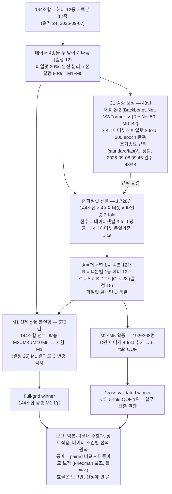

작성: 2026-09-08
작성자: 곽동신 (서버 클로드 정리)
용도: 2026-09-15 랩미팅에서 곽동신이 "이해한 바대로" 실험 설계를 설명하기 위한 순서도 + 대본
근거: platform/planning/안내.md 「지금 확정된 설계」, 260905_00_프로토콜_관리원칙.md 결정 12·15·24·25·26·27, 260906_파일럿_단계_및_결정규칙.md
그림: 같은 폴더 260908_실험설계_순서도.svg (편집 가능) · .png (슬라이드용, 2480px). 교수님 팁대로 GPT 이미지로 다시 그려도 됨. 그때 svg 의 글자를 그대로 쓰면 숫자가 안 틀림.
최종 수정: 2026-09-08 (C1 48/48 완주 실측 반영)

# 실험 설계 순서도 — 파일럿 → 선별 → 본실험

## 1. 그림 (mermaid)

런 수 합계: 1,728 + 576 + 192~368 = 2,496~2,672런. C1 48 포함 2,544~2,720런. C0(기존 6런)은 별도.

## 2. 발표 대본 (5분, 쉬운 말)

### 왜 이렇게 하나 (30초)
- 헤더 12개와 백본 12개를 전부 짝지으면 144개 조합입니다. 이걸 4개 데이터셋에서 5-fold로 다 돌리면 2,880런이라 못 합니다.
- 그래서 교수님이 "먼저 작은 데이터로 거른 다음, 전체 데이터는 한 번만 돌리고, 유망한 것만 다섯 번 돌리자"는 3단계 설계를 만드셨습니다.

### 1단계 — 데이터를 둘로 나눈다 (30초)
- 각 데이터셋(블루베리 1,195장, 사과 1,001장, 복숭아 125장, 포도 2,502장)을 20%와 80%로 나눕니다.
- 20%는 "파일럿"입니다. 후보를 고르는 데만 쓰고 본실험에는 절대 안 씁니다. 그래야 "고르는 데 쓴 데이터로 평가했다"는 지적을 피합니다.
- 80%는 "본실험"이고 다시 M1~M5 다섯 조각으로 나눕니다. 블루베리로 치면 파일럿 239장, 본실험 956장입니다.

### 1.5단계 — C1: 언제 학습을 멈출지 정한다 (40초)
- 1,728런을 돌리기 전에 "몇 epoch에서 멈출지"를 먼저 정해야 합니다. 이걸 대표 4쌍으로만 미리 재는 게 C1입니다.
- 대표는 고전 디코더(BackboneUNet)와 최신 디코더(VWFormer), CNN 백본(ResNet-50)과 Transformer 백본(MiT-B2)을 교차한 4쌍입니다.
- 4쌍 × 4데이터셋 × 파일럿 3-fold = 48런을 300 epoch 끝까지 돌리면서 매 epoch 성능을 기록합니다. 그 기록으로 "80 epoch 이후 40 epoch 안 좋아지면 멈춤(standard)"과 "40 이후 10(fast)" 중 어느 규칙이 손해가 적은지 봅니다.
- 여기서 나온 성적은 후보 고르는 데 안 씁니다. 규칙만 가져갑니다.
- 현황(2026-09-08 09:46 실측): 48런 전부 300 epoch 완주했고 체크포인트 3종이 다 있습니다. 런당 평균 1.72시간, 합계 82 GPU시간이었습니다. 규칙을 어느 쪽으로 할지는 교수님 판정이 남았습니다.
- 숫자를 물으시면: fast 규칙이 standard 대비 놓친 성능(regret, center-crop foreground IoU 기준)은 중앙값 0.0085, 평균 0.032입니다. 다만 최악은 0.604로, 복숭아 VWFormer×ResNet-50 fold2에서 fast는 42 epoch에 멈췄는데 standard는 175 epoch에서 훨씬 좋아졌습니다. 데이터셋별 중앙값은 포도 0.003, 사과 0.007, 블루베리 0.017, 복숭아 0.030입니다. 작은 데이터셋(복숭아 125장)일수록 늦게 좋아져서 빨리 멈추면 손해가 큽니다. standard 규칙은 평균 164 epoch에서 멈추고 fast 는 63 epoch에서 멈춥니다.

### 2단계 — P: 파일럿으로 거른다 (60초)
- 144조합을 파일럿 20% 안에서 3-fold로 돌립니다. 144 × 4 × 3 = 1,728런입니다.
- 점수는 Dice 하나입니다. 데이터셋마다 3-fold 평균을 내고, 4개 데이터셋을 똑같은 무게로 평균합니다. 속도나 메모리는 점수에 안 넣습니다.
- 고르는 규칙은 두 줄입니다. A = 헤더마다 가장 잘 맞는 백본 하나(12개). B = 백본마다 가장 잘 맞는 헤더 하나(12개). C = A와 B를 합친 것.
- 이렇게 하면 헤더 12개와 백본 12개가 전부 최소 한 번씩 C에 들어갑니다. 겹치는 게 있으니 C는 12개에서 23개 사이입니다.
- 파일럿이 끝나면 C를 잠급니다. 이후 결과를 보고 넣거나 빼지 않습니다.

### 3단계 — M1: 전체를 한 번 (40초)
- 144조합 전부를 본실험 80%로 한 번씩 돌립니다. M2~M5로 학습하고 M1로 시험합니다. 144 × 4 = 576런입니다.
- 이게 "144개 전체의 공정한 한 판 순위"입니다. 모든 조합이 같은 시험지를 풉니다.
- 주의: M1 결과를 보고 C를 바꾸면 안 됩니다.

### 4단계 — M2~M5: 유망한 것만 다섯 번 (30초)
- C에 든 12~23개 조합만 나머지 4개 fold를 더 돌립니다. 그러면 C는 5-fold가 완성됩니다. 16 × |C| = 192~368런입니다.
- 승자가 둘 나옵니다. "Full-grid winner"는 144개 전체의 M1 1등, "Cross-validated winner"는 C 안에서 5-fold 1등입니다. 최종 권장은 후자입니다. 둘이 다르면 왜 다른지(분할 의존, 데이터셋 차이, 상호작용)를 보고합니다.

### 마무리 (20초)
- 합치면 1,728 + 576 + 192~368 = 약 2,500~2,700런입니다.
- 통계는 짝지은 비교에 다중비교 보정이 주 분석이고, Friedman은 보조입니다. 블록은 데이터셋 4개입니다.
- 이 설계가 답하는 질문은 넷입니다. 어떤 조합을 추천할 것인가, 좋은 백본은 디코더가 바뀌어도 좋은가, 성능이 부품의 합인가 궁합인가, 최신 기법의 이득이 작고 빽빽하고 겹친 과실에서도 재현되는가.

## 3. 예상 질문과 답

- "C1 결과로 뭘 정하나" → 조기종료 규칙 하나입니다. 지금 숫자로는 fast(40/10)는 복숭아처럼 작은 데이터셋에서 후기 개선을 놓칩니다(최악 regret 0.604). standard(80/40)는 안전하지만 epoch가 2.6배 듭니다. 판정은 교수님이 하시고, 정하면 P 전에 동결합니다. C1 성적 자체는 후보 점수에 재사용하지 않고 P에서 새 seed로 다시 학습합니다.
- "P 1,728런은 얼마나 걸리나" → ❌ 추정입니다. C1 실측 런당 1.72시간(300 epoch)을 기준으로, standard 규칙(평균 164 epoch)이면 런당 약 0.94시간, 1,728런은 약 1,620 GPU시간, 8 GPU면 약 8.5일입니다. fast 규칙(평균 63 epoch)이면 약 620 GPU시간, 약 3.3일입니다. 교수님 안내.md도 "GPU-h 재산정 필요"로 두고 있습니다.
- "아직 안 정해진 설정은" → 05 문서 기준 weight decay, warm-up 길이, 최대 update 수(복숭아 125장과 포도 2,502장이 20배 차이라 epoch 대신 update로 맞출지), seed 개수, BN 처리, 실패 판정(NaN·OOM 재시작 횟수)입니다. 전부 P 시작 전에 동결합니다.
- "test는 어떻게 평가하나" → 전체 영상 슬라이딩 윈도우 512, stride 384(25% 겹침), threshold 0.5 고정, TTA·후처리 없음. 지표는 전체 영상 확률맵을 복원한 뒤 영상 단위로 계산합니다. test set은 프로토콜과 C가 동결된 뒤에만 엽니다.
- "옛 실험(C0)에 쓴 데이터는" → 복숭아 23장, 포도 250장을 validation으로 본 적이 있어서 그 group 전체를 파일럿에 넣고 prior_validation_exposure=true로 기록했습니다. 본실험에는 안 들어갑니다.

- "왜 144개를 5-fold 다 안 하나" → 2,880런이라 계산량 때문입니다. 대신 144개 전부 M1에서 같은 시험을 보게 하고, C만 5-fold로 확증합니다. 논문에는 "144 configurations on a common holdout, pilot-selected subset confirmed with five-fold"라고 씁니다. "전체 5-fold"라고 쓰지 않습니다.
- "C를 12~23개로 줄인 이유가 통계 검출력인가" → 아닙니다. 계산량, 두 축 대표성, 설명 단순성입니다. 검출력이라고 쓰면 안 됩니다(안내.md 잊으면 안 되는 것 2).
- "파일럿 성적으로 고르면 결과 의존 아닌가" → 파일럿 20%는 본실험에서 완전히 빠져 있습니다. 고르는 데이터와 평가하는 데이터가 다릅니다. 후보 선정(12×12)에는 성능을 전혀 안 썼습니다(결정 9).
- "C1은 왜 4쌍만" → 멈춤 규칙을 정하는 용도라 대표만 있으면 됩니다. 고전/최신 디코더 × CNN/Transformer 백본이면 궤적의 모양이 대충 다 나옵니다.
- "효율은 안 보나" → 봅니다. 파라미터, FLOPs, VRAM, 속도를 144개 전부 보고합니다. 다만 고르는 점수에는 안 넣습니다(결정 20).
- "복숭아 125장은 너무 적지 않나" → 맞습니다. 가중치는 그대로 두고 Kendall τ로 순위 안정성을 따로 보고합니다(결정 19).

## 4. 숫자 출처

- 144조합, 결정 24 · 파일럿 20/80, 결정 12 · A∪B 12~23, 결정 15 · M1 공통 + C만 M2~M5, 결정 25 · C1 2×2, 결정 26 · C1 300 epoch + ES 두 규칙, 결정 27 — 전부 platform/planning/260905_00_프로토콜_관리원칙.md
- 런 수 1,728 / 576 / 192~368 / 합계 2,496~2,672 — platform/planning/안내.md
- 블루베리 파일럿 239 / 본실험 956 — platform/work/ahn_hongryul/pilot/protocol_splits/v2_seed3407
