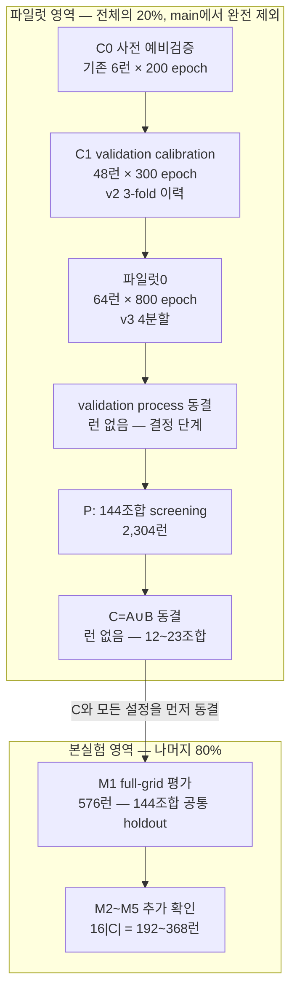

# 12×12 과실 분할 벤치마크 실험 설계 — 5분 랩미팅 설명 자료

> 근거 범위: 첨부된 `01_input_professor_protocol.md`만 사용했다.  
> 표기 원칙: 원문에 값이 없으면 **문서에 없음**, 원문이 추정치로 밝힌 값은 **❌ 추정**으로 표시했다.

## 1. 쉬운 말 정리

### 한 문장 요약

전체 데이터의 20%를 본실험과 완전히 분리된 파일럿으로 떼어 **144개(헤더 12×백본 12) 조합 중 추가 검증할 후보 C만 먼저 고정**하고, 나머지 80%에서는 **144개 모두를 같은 M1에서 비교한 뒤 C만 M2~M5까지 추가하여 5-fold로 확인**하는 계산량 절충 설계다.

### 2026-09-11에 바뀐 것과 그전의 차이

| 항목 | 2026-09-11 전 | 2026-09-11 이후 | 바뀌지 않은 것 |
|---|---|---|---|
| 파일럿 내부 분할 | C1은 v2 **3-fold**로 수행 | v3에서 파일럿 20%를 **4분할** | 전체의 파일럿 20% / main 80% 소속은 동일 |
| 한 회전의 역할 | C1은 3-fold validation calibration이며 학습 표본은 파일럿의 2/3 | 시험 fold `t`, 검증 fold `t+1`, 나머지 2개 fold로 학습 | 검증과 시험의 역할을 섞지 않음 |
| 회전 수 | C1: 데이터셋당 3회 | 파일럿0과 P: 데이터셋당 4회 | main은 M1~M5의 5-fold 유지 |
| C1 처리 | 48 trajectory, 300 epoch 완료 | 다시 하지 않고 **과거 이력으로 보존** | C1 점수는 후보 C 선정에 재사용하지 않음 |
| 파일럿0 | 문서에 없음 | 대표 4 pair×4 데이터셋×4회전 = **64런**, 800 epoch 완주 | 조기종료 없이 궤적 관찰 |
| 파일럿0 시험 fold | 문서에 없음 | 매 epoch 시험 지표도 기록 | 시험 점수로 epoch·규칙·설정을 고르면 안 됨 |
| 체크포인트 | C1은 last/standard-best/fast-best 3종 | 파일럿0은 검증 전경 IoU 최고와 epoch 800의 2종 | test가 아니라 validation으로 best를 고름 |
| 분할 재현성 | v2 seed 3407 | `v3_seed3407`; pilot fold만 재배정 | 20/80 소속, main 5-fold, group은 v2와 동일 |

핵심은 **3-fold였던 C1을 4-fold로 다시 한 것이 아니라**, C1은 그대로 보존하고 이후 파일럿0과 P부터 검증 fold와 시험 fold가 분리된 4분할 구조를 적용했다는 점이다. (00 §3 결정 29·30, 파일럿 §3~4)

### 데이터를 어떻게 나누는가

| 데이터셋 | 전체 장수 | 파일럿 20% | 파일럿 한 회전의 학습 / 검증 / 시험 | main 80% | main 한 반복의 학습 / 시험 |
|---|---:|---:|---:|---:|---:|
| 블루베리 | 1,195 | 239 | 119~120 / 59~60 / 59~60 | 956 | 765 / 191 |
| 사과 | 1,001 | 200 | 82~118 / 41~66 / 41~66 | 801 | 641 / 160 |
| 복숭아 | 125 | 25 | 12~13 / 6~7 / 6~7 | 100 | 80 / 20 |
| 포도 | 2,502 | 500 | 250 / 125 / 125 | 2,002 | 1,602 / 400 |

- 전체 영상은 **4,823장**이며 전경이 없는 전체 영상은 0장이다.
- 먼저 같은 나무·촬영 장면·인접 프레임을 `group_id`로 묶고, 가능한 경우 같은 그룹이 양쪽으로 갈라지지 않게 20/80을 한 번만 나눈다.
- 블루베리는 카메라·영상 단위, 사과는 capture-sequence 단위로 그룹을 보존한다. 포도와 복숭아는 검증 가능한 그룹 메타데이터가 없어 sample 단위로 나누며, 이는 한계로 기록한다.
- 파일럿 20% 안에서는 4분할한다. 매 회전마다 **학습 2 fold / 검증 1 fold / 시험 1 fold**이고, 각 fold는 시험과 검증에 각각 한 번씩 사용된다.
- main 80%는 M1~M5로 나눈다. 먼저 모든 조합이 `Train=M2∪M3∪M4∪M5`, `Test=M1`을 공통으로 쓴다. 이후 파일럿에서 고정한 C만 M2~M5를 각각 test로 쓰는 네 번을 추가한다.
- 파일럿 표본은 main의 학습이나 시험에 절대 재사용하지 않는다. 본실험 test는 프로토콜과 C를 모두 동결한 뒤에만 연다.

### 단계별 순서와 결정 권한

| 단계 | 런 수 | 이 단계가 결정하거나 확인하는 것 | 이 단계에서 결정하면 안 되는 것 |
|---|---:|---|---|
| **C0 사전 예비검증** | 기존 6런×200 epoch | calibration 코드와 후보 규칙의 1차 타당성 확인. 최종 결정은 없음 | 최종 조기종료 규칙, 후보 C, 본실험 설정 |
| **C1 validation calibration** | 48 trajectory×300 epoch | 같은 궤적에서 standard ES와 fast ES를 사후 비교하여 **조기종료 규칙**을 정할 근거 생성 | 4 pair의 우열, 모델 후보, loss·증강·공통 학습 설정, 후보 C |
| **파일럿0** | 64런×800 epoch | 4분할의 검증·시험 궤적과 자원 소비 관찰 | 시험 점수로 epoch·규칙·설정 선택. 이 단계의 최종 결정 권한 자체도 **문서에 미정** |
| **validation process 동결** | 런 없음(결정 단계) | 매-epoch center-crop validation, 조기종료·checkpoint 선택 절차를 확정 | 이후 P 결과에 맞춰 validation 규칙을 변경하는 것 |
| **P: candidate screening** | 2,304런 | 동결된 과정으로 144조합을 평가하고 **C=A∪B** 하나만 결정 | loss·scale·LR·증강·학습 예산·validation process 변경, 효율 지표로 선별 |
| **C 동결** | 런 없음(결정 단계) | C 12~23조합과 실행설정·코드·가중치·분할 hash를 고정 | 이후 M1 결과를 보고 C를 추가·삭제하는 것 |
| **M1 full-grid 평가** | 576런 | 144조합의 공통 holdout 순위, 주효과, 상호작용, **Full-grid winner** 보고 | 설정·C·평가 규칙 변경, 144조합 전체를 5-fold 결과라고 표현 |
| **M2~M5 confirmation** | `16|C|` = 192~368런 | C의 5-fold OOF 성능·안정성과 **Cross-validated winner** 보고 | 새로운 후보 추가, test 결과를 이용한 재설계 |

여기서 **validation은 checkpoint를 고르는 데이터**, **test는 선택이 끝난 모델을 평가하는 데이터**다. 특히 파일럿0에서 시험 궤적을 매 epoch 기록하더라도 그것으로 best epoch를 고르면 시험 fold가 사실상 validation으로 바뀌므로 금지된다.

### P에서 후보 C를 고르는 규칙

1. 144개 조합 각각을 4개 데이터셋×4회전으로 실행한다.
2. 각 회전에서는 검증 fold로 checkpoint를 고르고, 별도의 시험 fold에서 **image-macro Dice**를 구한다.
3. 데이터셋별로 4회전 시험 Dice를 평균한 뒤, 네 데이터셋을 **동일 가중**하여 조합 점수 하나를 만든다.
4. `A`는 **각 헤더마다 점수가 가장 높은 백본 1개**를 고른 12조합이다.
5. `B`는 **각 백본마다 점수가 가장 높은 헤더 1개**를 고른 12조합이다.
6. 최종 후보는 `C=A∪B`다. A와 B가 완전히 같으면 12개이고, 전체 최고 조합은 A와 B에 모두 들어가 최소 한 번 겹치므로 최대 23개다. 따라서 **12≤|C|≤23**이다.
7. 동점은 candidate ID 사전순으로 끊는다. 효율 지표는 후보 선정에 쓰지 않는다.

이 규칙의 뜻은 단순히 전체 점수 상위 몇 개만 뽑는 것이 아니라, **12개 헤더와 12개 백본이 C에 최소 한 번씩 등장하게 하여 두 축의 대표성을 보존**하는 것이다. C를 줄인 이유는 계산량·축 대표성·설명 단순성이며 통계 검출력 향상이 아니다. (00 §3 결정 15~20, 파일럿 §4)

### 승자가 둘인 이유

| 구분 | 누구를 비교하나 | 평가 범위 | 의미 |
|---|---|---|---|
| **Full-grid winner** | 144조합 전체 | main의 공통 M1 holdout 한 번 | 모든 조합을 같은 조건에서 비교한 **전체 grid의 M1 1위** |
| **Cross-validated winner** | 파일럿에서 고른 C만 | main M1~M5의 5-fold OOF | 여러 분할에서 확인한 **C 내부의 안정적인 1위**이며 실무 최종 권장 모델 |

계산량 때문에 144조합 전부를 5-fold로 돌리지 못한다. 그래서 전체 조합을 넓게 비교하는 M1 승자와, 유망 후보만 여러 fold에서 깊게 확인하는 교차검증 승자가 서로 다른 질문에 답한다. 둘이 다르면 오류가 아니라 분할 의존성, pilot→main 순위 변화, 데이터셋 이질성, 상호작용 등을 분석해야 한다.

### test 평가 방법

#### 1) 전체 영상 슬라이딩 윈도우

- 최종 checkpoint를 고른 뒤 test 전체 영상을 **딱 1회** 평가한다.
- 원본 해상도에서 512×512 window를 stride 384, 즉 25% overlap으로 이동시킨다.
- 끝부분도 모든 픽셀이 최소 한 번 포함되도록 마지막 window 위치를 조정한다.
- 512보다 작은 영상은 오른쪽과 아래만 padding하고, padding 영역은 평가에서 제외한다.
- 겹친 부분은 단순 평균으로 시작하되, **probability(sigmoid) 평균인지 logit 평균인지는 문서에 아직 미정**이다.
- threshold는 모든 모델에서 0.5로 고정한다. TTA, test-time resize, 후처리, connected-component 제거는 사용하지 않는다.
- window별 점수를 평균하지 않고, **전체 영상 확률맵을 먼저 복원한 뒤 영상 단위로 지표를 계산**한다.

#### 2) 지표

| 역할 | 지표 |
|---|---|
| 주 지표 | image-macro Dice |
| 보조 핵심 | image-macro IoU |
| 그 밖의 보조 | micro Dice, precision, recall |
| 경계 | Boundary IoU 또는 boundary F-score — 둘 중 최종 선택은 **문서에 없음** |
| 객체 수준 | 크기별 성능, 객체 precision/recall/F1 |
| 효율·운용 | parameters, FLOPs, peak memory, latency, throughput, 영상당 처리시간, window 수 |

image-macro Dice는 각 영상의 Dice를 먼저 구한 뒤 영상들에 동일한 무게로 평균하므로, 과실이 많은 일부 영상이 전체 점수를 지배하는 것을 막는다. 정확도는 전체 영상 슬라이딩으로, 하드웨어 효율은 512×512 center crop으로 따로 잰다.

#### 3) 통계

- 주 분석은 같은 영상의 예측을 짝지은 **paired 비교 + 다중비교 보정**이다.
- 정확한 비교 family와 보정 방법은 결과를 보기 전에 동결해야 한다. Holm은 예시일 뿐 최종 채택 여부는 **문서에 없음**이다.
- Friedman 검정은 보조·탐색적으로만 쓰며, 독립 블록은 fold 20개가 아니라 **데이터셋 4개(N=4)**다.
- C에는 5-fold OOF 결과, fold별 mean±SD, 영상 단위 paired 비교와 순위 안정성을 보고한다.
- 복숭아는 표본이 매우 작지만 가중치를 바꾸지 않고, 복숭아 순위와 나머지 3개 데이터셋 순위의 Kendall's τ를 진단으로 보고한다.

### 아직 안 정해진 것

#### 설계·판정값이 Pending인 항목

- 파일럿0이 최종적으로 무엇을 결정할지와 그 결정 권한
- 문헌 검색 cutoff 확정일
- 학습 seed의 개수와 값, window-bank 좌표 seed, 조합별 seed 배정 방식
- weight decay
- warm-up 길이(update 수 기준)
- gradient clipping
- 최대 optimizer update 수
- pretrained layer와 새 head의 learning-rate multiplier
- batch normalization 처리(freeze 또는 sync BN)
- deterministic 설정
- NaN·발산·OOM·weight 로딩 실패·인터페이스 불일치의 실패 정의와 허용 재시작 횟수
- 슬라이딩 중첩부의 probability 평균 또는 logit 평균
- inference batch size
- 매우 작은 객체에 크기 하한을 둘지
- 통계의 주효과·interaction 추정 모형, 비교 family, 정확한 다중비교 보정법
- 효율 측정의 warm-up 횟수와 latency 반복 횟수
- StrawDI 딸기 데이터셋의 편입 여부
- 파일럿 결과 보존 정책과 전체 저장량, 파일럿·본실험 GPU-hour 재산정

#### 결정 문제가 아니라 구현·점검이 끝나지 않은 항목

- 전체 영상 슬라이딩 윈도우 추론 코드
- foreground-aware sampling 70/30 구현
- 평가 augmentation의 두 분기가 모두 CenterCrop인 문제 수정
- 일부 헤더·백본 adapter, factory, 가중치, custom op의 전수 실측
- 효율 통합 스크립트, Boundary F1·객체 지표 확인, 데이터셋별 ranking·Kendall τ 코드
- 중복 이미지·손상 마스크·전경비 이상치·크기 불일치 등 대부분의 데이터 품질검사

> 문서 내부 표기 충돌: 안내 문서 앞부분은 결정 13을 미결이라고 적었지만, 우선순위가 더 높은 `00` 결정대장 §4는 VMamba-T v2 `s1l8`, checkpoint SHA-256, backend가 해소됐다고 명시한다. 따라서 이 자료에서는 **결정 13은 해소**로 읽었다.

### 논문에 쓰면 안 되는 표현 5개

| 쓰면 안 되는 표현 | 대신 쓸 표현 또는 이유 |
|---|---|
| “전수조사(exhaustive survey)” | 검색식이 보존되지 않았으므로 **candidate audit / scoping review** |
| “직교(orthogonal) taxonomy” | **multi-axis descriptive taxonomy** |
| 후보가 다른 계열을 “흡수·대체·완전중복”했다 | **family-stratified representative sampling** |
| “전체 데이터의 5-fold cross-validation” | 20% exclusive pilot, main 80%의 공통 M1, C만 5-fold OOF라고 구분 |
| “모델 수를 줄여 통계 검출력을 높였다” | 사실이 아님. C 축소 목적은 계산량·축 대표성·설명 단순성 |

## 2. 순서도

**런 수 합계:** 벤치마크 학습런 **3,072~3,248런**; C1 48런과 파일럿0 64런을 포함한 신규 전체 **3,184~3,360런**; 기존 C0 6런은 별도다. (파일럿 §6)

## 3. 5분 발표 대본

### 0:00~0:35 — 전체 설계 한눈에 보기 (35초)

“제가 이해한 이 설계의 핵심은, 12개 헤더와 12개 백본을 조합한 144개 모델을 전부 5-fold로 돌릴 수 없기 때문에, 넓게 비교하는 단계와 깊게 확인하는 단계를 나눈 것입니다. 전체 데이터의 20%는 파일럿으로 완전히 떼어 후보 C를 정하는 데만 쓰고, 나머지 80%가 본실험입니다. 파일럿은 본실험의 학습이나 시험에 다시 사용하지 않습니다.”

### 0:35~1:20 — 데이터 분할 (45초)

“데이터는 블루베리 1,195장, 사과 1,001장, 복숭아 125장, 포도 2,502장으로 총 4,823장입니다. 같은 나무나 같은 촬영 장면의 비슷한 사진이 양쪽에 섞이는 그룹 누출을 막기 위해, 가능한 데이터는 촬영 그룹 단위로 20% 파일럿과 80% main으로 한 번만 나눕니다. 파일럿 안에서는 네 fold로 나누고, 한 회전마다 두 fold는 학습, 한 fold는 validation, 즉 학습 중 checkpoint를 고르는 검증용, 한 fold는 test, 즉 선택이 끝난 모델의 점수를 재는 시험용으로 씁니다. main 80%는 M1부터 M5까지 다섯 fold로 나눕니다.”

### 1:20~2:10 — C0, C1, 파일럿0과 9월 11일 변경 (50초)

“먼저 C0는 기존 6런으로 코드와 후보 규칙을 예비 점검한 단계입니다. C1은 대표 네 조합을 네 데이터셋과 기존 3-fold에서 돌린 48개 trajectory, 즉 epoch별 학습 궤적입니다. 300 epoch를 끝까지 돌린 뒤 standard와 fast early stopping, 즉 성능 개선이 멈췄을 때 학습을 끝내는 두 규칙을 사후 비교합니다. 9월 11일에는 이후 파일럿 구조가 4분할로 바뀌었고, 파일럿0 64런을 800 epoch까지 돌려 검증과 시험 궤적, 자원 소비를 기록하게 됐습니다. 다만 시험 궤적으로 epoch나 설정을 고르면 안 됩니다. C1은 4분할로 다시 돌리는 것이 아니라 3-fold 이력으로 보존됩니다.”

### 2:10~3:05 — validation 동결과 P의 C 선정 (55초)

“C1과 파일럿0 뒤에는 validation과 checkpoint 선택 절차를 먼저 동결합니다. 그다음 P에서 144조합×4데이터셋×4회전, 총 2,304런을 같은 설정으로 실행합니다. 조합별 점수는 각 데이터셋의 네 시험 fold Dice 평균을 구하고, 네 데이터셋을 동일 가중해서 만듭니다. A는 헤더마다 가장 좋은 백본 하나씩인 12조합이고, B는 백본마다 가장 좋은 헤더 하나씩인 12조합입니다. C는 두 집합의 합집합이라 12개에서 23개가 됩니다. 이렇게 하면 모든 헤더와 백본이 후보에 최소 한 번은 포함됩니다. P가 성능으로 결정할 수 있는 것은 C 하나뿐이고, loss나 learning rate 같은 공통 설정은 바꾸지 않습니다.”

### 3:05~3:55 — 본실험과 두 승자 (50초)

“C를 고정한 다음 본실험을 엽니다. 먼저 144개 조합 모두를 M2부터 M5까지로 학습하고 같은 M1에서 평가하여 576런을 수행합니다. 여기서 나온 1등이 Full-grid winner입니다. 그다음 파일럿에서 정한 C만 M2부터 M5를 시험 fold로 하는 네 번을 추가해서 총 5-fold의 OOF, 즉 각 표본이 자신을 학습하지 않은 모델에게 한 번씩 예측된 결과를 만듭니다. 여기서 나온 1등이 Cross-validated winner이고 실무 최종 권장은 이 모델입니다. M1을 본 뒤 C를 바꾸는 것은 금지됩니다.”

### 3:55~4:35 — test 평가와 통계 (40초)

“최종 평가는 center crop이 아니라 원본 전체 영상을 512×512 창으로 나누고 stride 384, 25% 겹침으로 훑는 sliding window 방식입니다. 겹친 예측을 합쳐 전체 영상 확률맵을 복원한 다음 영상마다 Dice를 구해 평균한 image-macro Dice를 주 지표로 씁니다. 통계의 주 분석은 같은 영상에 대한 모델 예측을 짝지어 비교하고 다중비교를 보정하는 방식입니다. Friedman 검정은 보조이며 독립 블록은 fold 20개가 아니라 데이터셋 네 개입니다.”

### 4:35~5:00 — 결론: 이 설계가 답하려는 질문 4개 (25초)

“정리하면 이 설계는 네 질문에 답하려고 합니다.

1. 같은 조건의 M1에서 144개 헤더×백본 조합 중 무엇이 가장 좋은가?
2. 헤더 효과, 백본 효과, 그리고 둘의 상호작용은 어떻게 다른가?
3. 파일럿이 고른 C의 성능과 순위는 main의 다섯 fold에서도 안정적인가?
4. 정확도뿐 아니라 계산량과 실제 전체 영상 처리비용까지 고려할 때 실무에 권장할 조합은 무엇인가?”

## 4. 교수님이 물어볼 만한 질문 10개와 답

1. **왜 144조합을 전부 5-fold로 하지 않았나?**  
   계산량 제약 때문에 모든 조합은 같은 M1에서 공정하게 비교하고, 파일럿에서 사전 고정한 C만 나머지 네 fold를 추가하는 절충 설계를 택했다. 전체 grid의 공통 순위와 유망 조합의 fold 안정성을 둘 다 확보하려는 것이다. (**00 §3 결정 24·25, 파일럿 §5~6**)

2. **왜 20% 파일럿을 main에서 완전히 빼나?**  
   파일럿 성능으로 C를 고른 표본을 본실험에 다시 쓰면 선택 편향과 정보 누출이 생긴다. 그래서 파일럿은 protocol development와 screening에만 쓰고 main 학습·시험에 재사용하지 않는다. (**00 §1, §3 결정 12; 01 §2~3**)

3. **9월 11일에 정확히 무엇이 달라졌나?**  
   파일럿 내부가 v2 3-fold에서 v3 4분할로 바뀌어, 회전마다 학습 2·검증 1·시험 1 fold를 분리했다. 파일럿0 64런×800 epoch도 추가됐다. 단, C1 48런은 v2 3-fold 완료 이력으로 보존한다. (**00 §3 결정 29·30, 파일럿 §3~3-1**)

4. **파일럿0의 시험 점수를 매 epoch 보면서 왜 선택에는 못 쓰나?**  
   시험 점수로 best epoch나 설정을 고르면 시험 fold가 validation 역할을 하게 되어 독립 평가가 깨진다. 따라서 시험 궤적은 기록만 하고 checkpoint는 검증 전경 IoU로 고른다. (**00 §3 결정 30, 파일럿 §3-1**)

5. **P의 2,304런은 어떻게 계산했나?**  
   144조합×4데이터셋×데이터셋당 4회전이므로 2,304런이다. 각 회전은 학습 2 fold, 검증 1 fold, 시험 1 fold를 사용한다. (**파일럿 §4, §6; 01 §3**)

6. **왜 C가 12~23개인가?**  
   A와 B가 각각 12조합이고 C는 합집합이다. 두 집합이 같으면 12개이며, 전체 최고 조합은 해당 헤더의 top-1이면서 해당 백본의 top-1이라 A∩B에 최소 하나 존재하므로 합집합 최대는 23개다. (**00 §3 결정 15, 파일럿 §4**)

7. **P의 점수에 왜 네 데이터셋을 동일 가중하나?**  
   데이터셋 크기가 125장부터 2,502장까지 크게 달라 표본 수대로 합치면 포도가 점수를 지배할 수 있기 때문이다. 복숭아의 낮은 표본 수는 가중치를 바꾸지 않고 데이터셋별 ranking과 Kendall's τ로 진단한다. (**01 §3·§5, 00 §3 결정 16·19**)

8. **Full-grid winner와 Cross-validated winner가 다르면 어떤 것이 최종인가?**  
   실무 최종 권장은 C의 main 5-fold OOF 1위인 Cross-validated winner다. M1 1위는 144조합 전체를 같은 holdout에서 비교한 Full-grid winner로 별도 보고하고, 둘의 차이는 분할 의존성·pilot→main 순위 변화·데이터셋 이질성·interaction으로 분석한다. (**06 §4-1~4-2, 파일럿 §5**)

9. **왜 최종 test에 center crop을 쓰지 않나?**  
   center crop의 과일 포착률이 데이터셋별 22.7~60.7%로 다르고 과실의 75~77%가 채점되지 않기 때문이다. 따라서 center crop은 validation proxy와 효율 측정에만 쓰고, 정확도는 전체 영상을 sliding window로 복원한 뒤 잰다. (**00 §3 결정 2~4, 06 §1·§5**)

10. **지금 바로 본실험을 시작할 수 있나?**  
    아니다. 문서 상태가 아직 draft이고, validation process와 C를 순서대로 동결해야 하며, 슬라이딩 추론·sampling·일부 adapter 등 구현도 끝나지 않았다. 모든 프로토콜과 C를 동결하고 main 결과 디렉터리가 비어 있음을 확인한 뒤 test를 열어야 한다. (**00 §5~7, 안내 ‘코드 12건’, 06 §7**)
