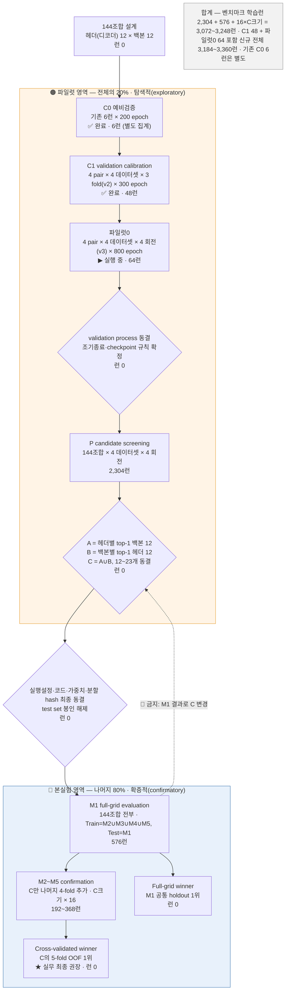

# 랩미팅 5분 발표 준비 — 실험 프로토콜 내가 이해한 대로

> **근거**: 첨부 문서(`01_input_professor_protocol.md`)만 사용. 문서에 없는 값은 **"문서에 없음"**으로 적었고, 문서가 `❌ 추정`으로 표시한 값은 그 표시를 그대로 유지했습니다. 제가 계산한 합계는 `(합산)`으로 표시했습니다.

---

# [1] 쉬운 말 정리

## 1-1. 한 문장 요약

과일 이진 분할(segmentation)에서 **디코더(헤더) 12종 × 백본 12종 = 144조합**을, **데이터의 20%(파일럿)에서만** 후보 12~23개로 좁히고, **나머지 80%(본실험)에서는 144조합 전부를 공통 M1 holdout 한 번으로 비교한 뒤 좁힌 후보만 5-fold로 확인**하는 설계입니다. — 즉 교수님이 말씀하신 "20% 남긴 것"이 이 설계의 핵심 장치입니다.

## 1-2. 2026-09-11에 바뀐 것 (결정 29·30)

| 항목 | 그 전 (~2026-09-10) | 2026-09-11 이후 |
|---|---|---|
| 파일럿 내부 분할 | **3-fold** (`v2_seed3407`) | **4분할** (`v3_seed3407`) — 회전마다 학습 2 / 검증 1 / 시험 1 |
| 회전 수 | 데이터셋당 3 | 데이터셋당 **4** (모든 fold가 시험 1번·검증 1번) |
| 회전당 학습 표본 | 파일럿의 **2/3** | 파일럿의 **2/4** |
| 검증과 시험의 분리 | 분리 안 됨 (결정 29의 사유로 명시) | **checkpoint 고르는 검증 fold 와 점수 재는 시험 fold 분리** |
| 대표 2×2 추가 실험 | C1 **48런 × 300 epoch** (완료, 이력 보존) | **파일럿0 64런 × 800 epoch** 추가 (결정 30) |
| 조기종료 | C1: 300 완주 후 standard/fast ES **사후 재생** | 파일럿0: 조기종료 없이 **800 완주** |
| checkpoint 종류 | **3종** (`last_converged` · standard-best · fast-best) | **2종** (검증 전경 IoU 최고 = best · epoch 800 = final) |
| 매 epoch 기록 | 검증만 | **검증 + 시험 둘 다** + 단계별 CPU/RAM/GPU 자원 |
| 20/80 소속 · main 5-fold · group | — | **불변** (v2와 동일함을 행 단위 검증) |
| 신규 전체 런 수 | 문서에 없음 | **3,184~3,360런** |

> 안 바뀐 것: 파일럿 20% 완전 제외(결정 12), 144조합(결정 24), 선별 규칙 A∪B(결정 15), Dice 단일 점수(결정 16), 본실험 M1 + C의 M2~M5(결정 25).

## 1-3. 데이터를 어떻게 나누는가

**원칙 3개** — ① 파일럿 20%는 본실험 학습에도 시험에도 **절대 재사용 안 함**(결정 12, `01` §2) ② 같은 나무·같은 촬영 장면·인접 frame은 **같은 쪽**(`01` §3) ③ 본실험 test는 **모든 프로토콜과 C가 동결된 뒤에만** 개봉(`01` §3, `06` §7).

| 데이터셋 | 전체 | 파일럿 20% | 파일럿 회전당 학습/검증/시험 | 본실험 80% | 반복당 학습 64% | 반복당 시험 16% | fold 방식 |
|---|---:|---:|---|---:|---:|---:|---|
| 블루베리(자체) | **1,195** | 239 | 119~120 / 59~60 / 59~60 | 956 | 765 | 191 | GroupKFold (카메라·영상) |
| 사과(MinneApple) | **1,001** | 200 | 82~118 / 41~66 / 41~66 | 801 | 641 | 160 | GroupKFold (촬영 시퀀스) |
| 복숭아 | **125** | 25 | **12~13 / 6~7 / 6~7** | 100 | 80 | 20 | KFold (seed) |
| 포도(CERTH) | **2,502** | 500 | 250 / 125 / 125 | 2,002 | 1,602 | 400 | KFold (seed) |
| **합계** | **4,823** | 964 *(합산)* | — | 3,859 *(합산)* | — | — | — |

- 전경 0인 **영상**은 4,823장 전량에서 **0장(0.0%)** — 자주 인용되던 8.8%는 "센터크롭 안에 과일 0개"인 비율이라 영상 단위 지표의 근거로 쓰면 안 됨(`01` §1, `06` §3).
- 그룹 누출 검사: 사과·블루베리 group 교차 **0건**. 포도·복숭아는 검증 가능한 group metadata가 없어 sample 단위 fallback(`01` §3~4).
- 과거 validation에 노출된 **복숭아 23장·포도 250장**은 그 group 전체를 파일럿에 강제 배정하고 `prior_validation_exposure=true`로 기록(`01` §3, `260906` §2).
- StrawDI(딸기, 3,100장)는 **편입 🟡 미정** — 보고용 데이터셋으로 쓸 계획이면 파일럿으로 못 씀(`01` §1).

## 1-4. 단계 순서 — 무엇을 결정하고, 무엇을 결정하면 안 되는가

| # | 단계 | 런 수 | **이걸로 정하는 것** | **이걸로 정하면 안 되는 것** | 근거 |
|---|---|---:|---|---|---|
| ⓪ | C0 예비검증 | 6 × 200ep ✅완료 | calibration 코드·후보 규칙의 **1차 타당성(잠정)** | 최종 규칙 | `260906` §1~2 |
| ④ | C1 validation calibration | 48 × 300ep ✅완료 | **조기종료(early stopping) 규칙** | loss·모델 후보·공통 학습 설정. **C1 pair의 우열을 후보 선정에 쓰는 것** | 결정 14·27, `260906` §3 |
| ④′ | 파일럿0 | 64 × 800ep ▶실행중 | **🟡 미정 — "이 단계로 무엇을 결정할지 사용자 확정 필요"** | 시험 궤적으로 epoch·규칙·설정 고르기 | 결정 30, `260906` §1·3-1 |
| ⑤ | validation process 동결 | 0 | 조기종료·checkpoint 규칙 확정 | — | `00` §5 |
| ⑥ | P candidate screening | **2,304** | **후보 집합 `C = A∪B` 오직 하나** | validation process·공통 학습 설정 변경 | 결정 15·16, `260906` §4 |
| ⑥′ | C 동결 | 0 | C 확정 | 이후 어떤 이유로든 변경 | `00` §5 |
| ⑦ | M1 full-grid | **576** | 144조합 순위·주효과·상호작용 **보고** | **C 추가·삭제(명시적 금지)**, 설정 변경 | 결정 25, `260906` §5 |
| ⑧ | M2~M5 confirmation | **192~368** | C의 fold 안정성·OOF 성능 **보고** | 어떤 설계 변경도 | `260906` §1·5 |

**관통하는 절대 규칙(`00` §1)**: *후보 선정에 본실험 성능을 쓰지 않는다.* 이 규칙은 **설정에도 적용**되어, loss·증강·학습·검증·평가 설정은 screening 전에 전부 확정합니다. 파일럿이 성능으로 고를 수 있는 것은 `C` 하나뿐입니다. (2026-09-05 외부검증에서 CCASeg 선정 근거가 결과 의존적 선택으로 판명돼 제거된 실제 위반 사례가 있음.)

## 1-5. P에서 후보 C를 고르는 규칙 (결정 15·16)

1. **점수**: `image-macro Dice` **단일**. 데이터셋별 **4회전의 시험 fold** Dice를 평균 → **4개 데이터셋 동일가중**. checkpoint는 각 회전의 **검증 fold**로 선택.
2. **A** = 헤더(디코더)별 top-1 백본 → 12개
3. **B** = 백본별 top-1 헤더 → 12개
4. **C = A ∪ B**, `12 ≤ |C| ≤ 23`. 동점은 candidate ID **사전순**.
5. **왜 12~23인가**: A와 B가 각 축 12종을 전부 담으므로 최소 12. 그리고 전체 최고 조합은 **반드시 A∩B에 속하므로** 최소 1개가 겹쳐 24가 아니라 **최대 23**.
6. **왜 좁히는가**: 계산량 · 축 대표성 · 설명 단순성. **"통계 검출력" 때문이 아님**(결정 18).
7. 효율 지표(FLOPs·latency 등)는 선별에 **일절 관여하지 않음**(결정 20).

## 1-6. 승자가 둘인 이유 (`06` §4)

| | **Full-grid winner** | **Cross-validated winner** |
|---|---|---|
| 정의 | 144조합의 **공통 M1 holdout** 1위 | **C의 main 5-fold OOF** 1위 |
| 대상 | 144조합 전부 | 사전 고정된 C(12~23개)만 |
| 학습/시험 | Train = M2∪M3∪M4∪M5, Test = M1 | M1~M5 전체 OOF |
| 강점 | 전체 grid의 공통 조건 순위·주효과·상호작용 | 분할을 바꿔도 유지되는 **안정성** |
| 논문 위치 | 전체 지형 보고 | **실무 최종 권장 = 이쪽** |

두 승자가 다르면 **분할 의존성 · pilot→main 순위 변화 · dataset 이질성 · interaction · C의 M1 top-1/top-3/top-5 포착률**을 보고합니다. 두 순위를 **같은 것으로 섞어 쓰면 안 됩니다**(안내 §잊으면 안 되는 것 3).

## 1-7. test 평가 방법 (`06` §1~4)

| 항목 | 값 |
|---|---|
| 대상·방식 | test **전체 영상**, **sliding window** (최종 checkpoint 확정 후 **딱 1회**) |
| window / stride | **512×512 / stride 384 (겹침 25%)**, 모든 픽셀이 최소 1회 포함되도록 마지막 window 위치 조정 |
| padding | 512 미만 영상은 오른쪽·아래만, **padding 영역은 평가 제외** |
| 중첩 결합 | probability(sigmoid) 또는 logit **평균** — 🟡 둘 중 하나로 확정 필요 |
| threshold / TTA / resize / 후처리 | **0.5 고정** / 안 씀 / 안 함 / 안 함 (connected-component 제거도 안 함) |
| 주 지표 | **image-macro Dice** (영상별 Dice를 구한 뒤 평균) |
| 보조 | image-macro IoU · micro Dice · precision · recall · Boundary IoU 또는 F-score · 객체 수준 지표 |
| 계산 단위 | 🔴 전체 영상 확률맵을 복원한 뒤 **영상 단위**로 계산 (window별 평균 금지 — 경계 과일이 중복 계산됨) |
| 통계 주 분석 | **paired 비교 + 다중비교 보정**(예: Holm, family 사전 선언) |
| 통계 보조 | Friedman·Nemenyi. **독립 블록 = dataset 4개**(같은 dataset의 fold를 20블록으로 세지 않음, ✅ `demsar2006statistical`) |
| 저표본 진단 | 복숭아 ranking vs 나머지 3개의 **Kendall's τ**, 가중치는 불변(결정 19) |
| 효율 | **Report-only.** 정확도는 전체영상 슬라이딩, 효율은 512 센터크롭으로 입력 자체를 분리 |

**센터크롭을 주 평가로 쓰지 않는 이유(실측, cv1 test 963장)**: 과일 포착률이 블루베리 24.4% · 사과 22.7% · 복숭아 60.7% · 포도 25.0%로, 과실의 **75~77%가 아예 채점되지 않고** 데이터셋 간 **2.7배 차이**가 납니다. → 센터크롭은 **효율 측정 전용**.

## 1-8. 아직 안 정해진 것

**A. 학습 설정 (`05` §1~2)** — weight decay · warm-up · gradient clipping · **최대 optimizer update 수(🔴)** · pretrained vs 새 head의 lr multiplier · BN 처리(freeze/sync) · **seed 개수와 값** · deterministic 설정 · 실패 판정 정의와 재시작 허용 횟수(`05` §7)

**B. 평가 (`06`)** — 중첩 결합을 확률 평균으로 할지 logit 평균으로 할지 · inference batch size · 매우 작은 객체의 크기 하한 · 효율 측정의 warm-up/반복 횟수

**C. 단계 권한** — **파일럿0으로 무엇을 결정할지 🟡 미정**(결정 30) ← 이번 미팅에서 교수님 확정이 필요한 항목

**D. 자원·코드** — 파일럿 screening·M1·M2~M5의 **GPU-h 전부 재산정 필요(🔴)**, 저장량·파일럿 보존 정책 미동결. 코드 12건 중 **O-1 슬라이딩 윈도우 추론 0건**, **O-6 foreground-aware sampling 없음**, **O-9 `augmentations.py:340`이 두 분기 모두 CenterCrop(🔴)**, **O-11 Kendall τ 산출 없음**. 헤더 OCRNet·U-MixFormer·VWFormer·HamNet, 백본 HRNet·VMamba·MSCAN·InternImage·TransNeXt·MogaNet·vHeat의 구현·factory·가중치·custom op **전수 실측 전에는 144조합 실행 불가**

**E. 기타** — 문헌 검색 cutoff 날짜 미확정 · StrawDI 편입 미정 · 데이터 품질검사 대부분 미실행

**F. 문서 안에서 서로 어긋나 보이는 곳 2 (확인 요청용)**
1. **결정 13(VMamba-T 버전 동결)** — `안내.md`는 "13 미결"로, `00` §4는 "해소: v2 `s1l8`, SHA-256·`selective_scan_torch` backend 동결(2026-09-08)"로 적혀 있습니다. 정본 판정 규칙 2(값이 충돌하면 `00` 결정대장 우선)에 따르면 **해소**로 읽는 게 맞다고 이해했습니다.
2. **screening 점수의 fold** — `00` §1 본문은 "파일럿 **validation** Dice로 C 선정", 결정 16과 `260906` §4는 "**시험 fold** Dice(checkpoint는 검증 fold)"로 되어 있습니다. 같은 규칙에 따라 **시험 fold**로 읽었습니다.

## 1-9. 논문에 쓰면 안 되는 표현 5개 (`00` §8, 안내 §잊으면 안 되는 것)

| # | ❌ 쓰면 안 됨 | 왜 | ⭕ 대신 |
|---|---|---|---|
| 1 | "전체 데이터의 5-fold cross-validation" | 파일럿 20%를 뗀 순간 전체 기준 5-fold가 성립 안 함. 5-fold OOF는 **C에만** 해당 | *20% exclusive pilot; all 144 configurations on a common independent M1 holdout from the main 80%; pilot-selected C confirmed with five-fold OOF* |
| 2 | "전수조사 (exhaustive survey)" | 검색식 문자열이 보존되지 않음 | *candidate audit / scoping review* |
| 3 | "모델 수를 줄여 통계 검출력을 높였다" | 사실이 아님(결정 18). 블록 수는 4로 고정 | 계산량·축 대표성·설명 단순성을 위한 선별 |
| 4 | "직교(orthogonal) taxonomy" | 축이 실제로 직교하지 않음 | *multi-axis descriptive taxonomy* |
| 5 | "모델 선정은 성능과 무관했다" | 파일럿 Dice로 C를 좁힌 것은 사실. 숨기면 안 됨 | *pilot-based candidate narrowing on a disjoint 20% split, frozen before any main-split evaluation* |

> 원고 쪽 별건으로 **"identical 12.6%" 공정성 논거 삭제**(포착률 22.7~60.7%), **`main.tex:506` 2.07 MP는 공통 해상도가 아니라 최대 픽셀 예산**, **블루베리 "1,089장" 주장은 서버 어디에도 근거 없음**도 같이 걸려 있습니다.

---

# [2] 순서도

**런 수 합계 한 줄**: 벤치마크 학습런 `2,304 + 576 + 16×|C| = 3,072~3,248런`, C1 48런과 파일럿0 64런을 포함한 **신규 전체 3,184~3,360런**, 기존 C0 6런은 별도.

---

# [3] 5분 발표 대본

**(도입 — 약 25초)**
제가 이해한 실험 설계를 5분으로 정리했습니다. 한 문장으로 말하면 — **디코더 12종과 백본 12종을 곱한 144조합을, 데이터의 20%에서만 12~23개로 좁히고, 나머지 80%에서는 144조합 전부를 한 번 공통 비교한 뒤 좁힌 후보만 5겹으로 확인하는 설계**입니다. 교수님이 "12×12를 다 못 하니까 20%를 남겼다"고 하신 게 바로 이 장치입니다.

**(큰 그림 — 약 40초)**
여기서 **백본(backbone)**은 영상에서 특징을 뽑는 몸통이고, **헤더 또는 디코더**는 그 특징을 받아 픽셀 단위 마스크로 만드는 머리 부분입니다. 12×12를 교차하는 이유는 백본 효과와 디코더 효과, 그리고 둘의 **상호작용**을 같은 조건에서 분리해 보기 위해서입니다(결정 24). 144조합 전부를 5겹 교차검증하면 계산량이 감당이 안 되기 때문에, 계산량 제약 안에서 전체 지형과 안정성을 둘 다 확보하는 절충이 결정 25입니다.

**(데이터 분할 — 약 45초)**
데이터는 블루베리 1,195장, 사과 1,001장, 복숭아 125장, 포도 2,502장 — 전체 4,823장입니다. 이걸 **파일럿 20%와 본실험 80%로 딱 한 번** 자릅니다. 자를 때 같은 나무·같은 촬영 장면·인접 프레임은 반드시 같은 쪽으로 보내서 정보가 새지 않게 하고, 사과·블루베리는 그룹 교차 0건으로 검증했습니다. 파일럿 표본은 본실험 학습에도 시험에도 **절대 다시 쓰지 않습니다**. 본실험 80%는 다시 M1부터 M5까지 다섯 덩어리로 나눕니다.

**(파일럿 3단계 — 약 55초)**
파일럿 안은 **9월 11일에 3분할에서 4분할로 바뀌었습니다**(결정 29). 회전마다 시험 fold 하나, 검증 fold 하나, 나머지 둘로 학습해서 데이터셋당 4회전을 돕니다. 바뀐 이유는 **체크포인트를 고르는 검증 fold와 점수를 재는 시험 fold를 분리**하기 위해서입니다. 순서는 C0 6런, C1 48런, 파일럿0 64런입니다. C1은 300 epoch를 끝까지 돌려놓고 **조기종료(early stopping)** 규칙 두 개를 사후에 재생해 비교한 단계고, 파일럿0은 800 epoch 완주로 검증·시험 궤적을 함께 관측하는 단계입니다. 여기서 정하는 건 **모델이 아니라 검증 절차**입니다.

**(C 선정 규칙 — 약 45초)**
검증 절차를 동결한 다음, 144조합 × 4데이터셋 × 4회전 = **2,304런**을 돌립니다. 점수는 **image-macro Dice 하나**, 즉 영상별 Dice를 평균한 값이고, 4개 데이터셋을 **동일 가중**으로 묶습니다. 포도가 20배 많아서 점수를 지배하지 않게 하기 위해서입니다. 그 다음 **헤더별 최고 백본 12개를 A**, **백본별 최고 헤더 12개를 B**로 두고 **합집합 C**를 만듭니다. 최소 12개, 그리고 전체 최고 조합은 반드시 A와 B 양쪽에 들어가므로 **최대 23개**가 됩니다. 여기서 C를 확정하고 **동결**합니다.

**(본실험과 두 승자 — 약 45초)**
본실험에서는 먼저 **144조합 전부**를 M2~M5로 학습해 M1에서 평가합니다 — 576런. 그 다음 **동결된 C만** M2부터 M5까지 시험 fold를 돌려 4번 더 합니다. 그래서 승자가 둘입니다. **Full-grid winner**는 공통 M1 1위, **Cross-validated winner**는 C의 5겹 OOF, 즉 **out-of-fold** 1위이고, 논문의 실무 최종 권장은 **후자**입니다. 가장 중요한 제약은 — **M1 결과를 보고 C를 추가하거나 빼는 것은 금지**라는 점입니다.

**(test 평가와 통계 — 약 25초)**
최종 test는 센터크롭이 아니라 **전체 영상 슬라이딩 윈도우**입니다. 512 창을 384 간격으로 25% 겹치게 밀고, 확률맵을 복원한 뒤 **영상 단위로** 지표를 계산합니다. 센터크롭은 과일의 75~77%를 아예 채점하지 못하고 데이터셋 간 포착률이 2.7배 차이라서 효율 측정 전용으로 내렸습니다. 통계는 **짝지은 비교 + 다중비교 보정이 주 분석**이고 Friedman은 보조, 독립 블록은 데이터셋 4개입니다.

**(미정과 마무리 — 약 25초)**
아직 안 정해진 것 중 제가 가장 급하다고 본 건 세 가지입니다 — **파일럿0으로 무엇을 결정할지가 미정**이라는 것, **슬라이딩 윈도우 추론 코드가 아직 0건**이라는 것, 그리고 **파일럿 이후 단계의 GPU 시간이 전부 재산정 대상**이라는 것입니다.

**이 설계가 답하려는 질문 4개**
1. **백본과 디코더 중 무엇이 성능을 더 좌우하며, 둘 사이에 상호작용이 있는가?** (결정 24, `06` §4-1)
2. **공통 독립 holdout에서 144조합의 1위는 무엇인가?** — Full-grid winner (결정 25, `06` §4-1)
3. **파일럿이 고른 후보가 분할을 바꿔도 유지되는가?** — Cross-validated winner (`06` §4-2)
4. **과종이 달라도 순위가 유지되는가?** — 데이터셋 이질성과 복숭아 저표본, Kendall τ (결정 19, `06` §4-3)

---

# [4] 예상 질문 10개와 답

| # | 질문 | 답 (근거) |
|---|---|---|
| 1 | 왜 144조합을 전부 5-fold 하지 않고 20%를 떼어냈나? | 계산량 제약과 **파일럿 재사용 편향 제거** 둘 다입니다. 파일럿 표본을 본실험에 되쓰면 후보 선정에 쓴 정보가 확증 단계로 새기 때문에, 20%를 완전히 분리하고 본실험에서는 144조합 공통 M1 + C만 5-fold라는 절충을 씁니다. *(결정 12·25, `00` §1, `01` §2)* |
| 2 | 파일럿 성능으로 조합을 고르는 것도 결과 의존적 선택 아닌가? | 절대 규칙이 금지하는 것은 **본실험 test 성능** 사용입니다. 파일럿은 20/80으로 표본이 완전히 분리되고 재사용이 없어 누출이 없습니다. 다만 논문에 이 단계를 **숨기지 않고 명시**하고, "모델 선정은 성능과 무관했다"고 쓰지 않습니다. *(결정 9, `00` §1의 ⚠️ 설계 쟁점)* |
| 3 | C가 왜 하필 12~23개인가? | A(헤더별 top-1 백본 12)와 B(백본별 top-1 헤더 12)가 각 축 12종을 전부 담으므로 최소 12, 그리고 **전체 최고 조합은 반드시 A∩B에 속해** 최소 1개가 겹치므로 최대 23입니다. *(결정 15, 안내 §지금 확정된 설계)* |
| 4 | 후보를 줄이면 통계 검출력이 올라가지 않나? | 아닙니다. 그렇게 쓰면 안 되는 문구로 명시돼 있습니다. 블록 수는 데이터셋 4개로 고정이라 C를 줄여도 검출력은 변하지 않고, 축소 사유는 **계산량·축 대표성·설명 단순성**입니다. *(결정 18, `00` §8, `06` §4-3)* |
| 5 | 파일럿0으로 정확히 무엇을 결정하나? | 문서상 **🟡 미정**입니다. 결정 30과 `260906` §1에 "이 단계로 무엇을 결정할지 사용자 확정 필요"로 남아 있어, 오늘 확정이 필요한 항목으로 봤습니다. 현재 명확한 것은 **시험 궤적으로 epoch·규칙·설정을 고르지 않는다**는 금지 조항뿐입니다. *(결정 30, `260906` §1·3-1)* |
| 6 | 800 epoch은 과한 것 아닌가? | 9/12 12시 기준 완료된 포도 16런의 best epoch가 **113~685로 흩어져** 있어 짧은 예산으로는 후기 개선을 놓칠 수 있습니다. 다만 같은 런에서 best 시점 시험 Dice 0.940~0.956, 800 시점 0.936~0.957로 **차이가 크지 않다**는 것도 함께 보고해야 한다고 봅니다. *(추가 실측, `05` §5)* |
| 7 | 그럼 fast 조기종료를 쓰면 되지 않나? | C1 48런 실측에서 fast의 regret 중앙값은 0.0085로 작지만 **최악이 0.604**(복숭아 VWFormer×ResNet-50 fold2, fast 42ep vs standard 175ep)이고 데이터셋별 중앙값도 포도 0.003 ↔ 복숭아 0.030으로 차이가 납니다. 평균 종료는 standard 164ep vs fast 63ep입니다. 규칙 자체는 ⑤ **validation process 동결** 단계에서 확정합니다. *(추가 실측, `05` §3, `260906` §3)* |
| 8 | 복숭아는 회전당 학습이 12~13장인데 1/4 가중을 그대로 두나? | 예. 가중치를 손대면 그것 자체가 새 설계 파라미터가 되므로 **불변**으로 두고, 대신 데이터셋별 144조합 ranking 전량 보존 + **복숭아 vs 나머지 3개의 Kendall τ** 보고 + 논문 limitation 명시로 처리합니다. *(결정 19, `01` §3, `06` §4)* |
| 9 | 최종 평가를 센터크롭으로 하면 훨씬 싸지 않나? | cv1 test 963장 실측에서 과일 포착률이 사과 22.7% ~ 복숭아 60.7%로 **2.7배 차이**가 나고 과실의 75~77%가 채점되지 않습니다. 그래서 최종 정확도는 **전체영상 슬라이딩(512/384/25%)**, 센터크롭은 **효율 측정 전용**입니다. 원고의 "identical 12.6%" 공정성 논거도 이 때문에 삭제 대상입니다. *(결정 2, `06` §1·5)* |
| 10 | 지금 당장 실행을 막고 있는 건 무엇인가? | 네 가지입니다. ① 12헤더×12백본의 구현·factory·가중치·custom op **전수 실측이 끝나기 전에는 144조합 실행 불가** ② 코드 O-1 **슬라이딩 추론 0건**, O-6 foreground-aware sampling 없음, O-9 `augmentations.py:340` 두 분기 모두 CenterCrop ③ 파일럿 screening·M1·M2~M5의 **GPU-h 전부 재산정 필요** ④ 학습 설정의 `Pending` 항목(최대 update 수·seed·weight decay 등)은 **screening 전에** 전부 동결돼야 함. *(안내 §코드 12건·§자원, `00` §4의 21 적용 절대 조건, `05` §1~2)* |

---

**부록 — 이번 미팅에서 제가 확인받고 싶은 것 3개**
1. 파일럿0의 **결정 권한** (결정 30의 🟡 미정)
2. 결정 13의 상태 — `안내.md`는 미결, `00` §4는 해소로 읽힘
3. screening 점수를 **시험 fold** Dice로 읽는 게 맞는지 (`00` §1 본문은 validation으로 표기)
