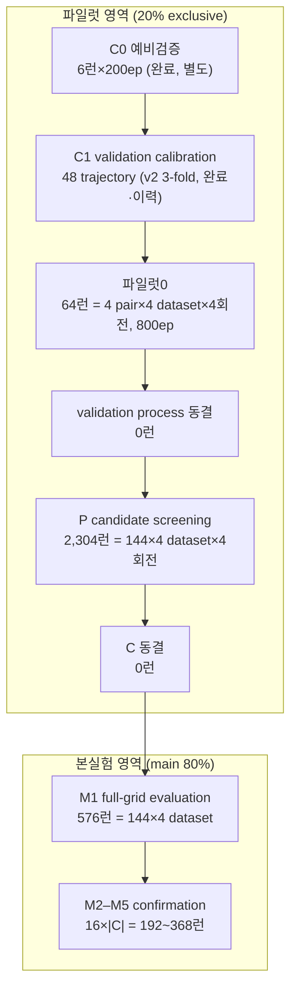

아래는 첨부한 교수님 프로토콜 원문만 근거로 만든 랩미팅용 정리입니다.  
문서에 값이 없는 항목은 **“문서에 없음”**, 추정이면 **“❌ 추정”**으로 표시했습니다.

---

# [1] 쉬운 말 정리 (초보용)

## 한 문장 요약
**144개(12 heads × 12 backbones) 조합을 전부 본실험에서 다 5-fold로 돌리는 대신, 각 데이터셋의 20%를 파일럿으로 떼어 사전에 정한 규칙으로 후보 C(12~23개)를 고르고, 나머지 80%에서 144개는 공통 M1 holdout으로, C만 M1~M5 5-fold OOF로 확인하는 2층 실험 설계**입니다.

## 2026-09-11에 바뀐 것과 그 전의 차이

| 항목 | 2026-09-11 이전 | 2026-09-11 이후 | 근거 |
|---|---|---|---|
| 파일럿 내부 분할 | v2 3-fold 중심, C1 48 trajectory 완료 | **v3 4분할**. 회전마다 시험 fold t, 검증 fold t+1(순환), 나머지 2 fold 학습 | 결정 29, `260906` |
| 파일럿0 | 문서상 없음 | **64런 = 4 pair × 4 dataset × 4회전, 800 epoch 완주** | 결정 30, `260911_파일럿0/README.md` |
| C1 지위 | 48 trajectory, 300 epoch 완료 | **v2 3-fold 이력으로 보존.** 4분할 수치와 직접 비교 금지 | 결정 29, `260906` |
| 파일럿 회전당 학습량 | 파일럿의 2/3 | **파일럿의 2/4로 감소** | 결정 29, `260911_파일럿0/README.md` |
| 20/80, main 5-fold, group | v2와 동일 | **v3에서도 동일하게 유지** | `260905_01`, `260906` |
| 파일럿0 checkpoint | C1은 3종 checkpoint | 파일럿0은 **best val fg IoU 1개 + epoch 800 final 1개** | 결정 30, `260911_파일럿0/README.md` |

## 데이터를 어떻게 나누는지

전체 데이터를 먼저 **파일럿 20% / 본실험 80%**로 한 번만 나눕니다. 파일럿은 본실험 학습·시험에 절대 재사용하지 않습니다. 파일럿 안은 4분할 회전, 본실험 80% 안은 M1~M5 5-fold입니다.

| 데이터셋 | 전체 | 파일럿 20% | 파일럿 회전당 학습/검증/시험 | 본실험 80% | 본실험 반복당 학습 64% | 본실험 반복당 시험 16% |
|---|---:|---:|---:|---:|---:|---:|
| 블루베리 | 1,195 | 239 | 119~120 / 59~60 / 59~60 | 956 | 765 | 191 |
| 사과 | 1,001 | 200 | 82~118 / 41~66 / 41~66 | 801 | 641 | 160 |
| 복숭아 | 125 | 25 | 12~13 / 6~7 / 6~7 | 100 | 80 | 20 |
| 포도 | 2,502 | 500 | 250 / 125 / 125 | 2,002 | 1,602 | 400 |

- 사과는 capture-sequence 그룹을 fold 사이에 나누지 않아 fold 크기가 41~66장으로 고르지 않습니다.
- 복숭아 파일럿 학습분이 회전당 12~13장이라 변동이 큽니다. 가중치는 바꾸지 않고 **Kendall τ로 보고**합니다(결정 19).

## 단계 순서: 무엇을 결정하고, 무엇을 결정하면 안 되는가

| 단계 | 규모 | 결정하는 것 | 결정하면 안 되는 것 |
|---|---:|---|---|
| C0 예비검증 | 6런×200 epoch, 완료·별도 | calibration 코드·후보 규칙 1차 타당성 | 최종 규칙 확정, 후보 선정 |
| C1 validation calibration | 48 trajectory, v2 3-fold, 300 epoch, 완료·이력 | 매 epoch center-crop 궤적에서 standard/fast ES 비교, 조기종료 규칙 후보 | loss·모델 후보·공통 학습 설정 선택, C1 점수를 P 후보 점수로 재사용 |
| 파일럿0 | 64런, 4분할, 800 epoch | 4분할 회전의 검증·시험 궤적과 자원 소비. **결정 권한은 🟡 미정 — 사용자 확정 필요** | 시험 점수로 epoch·규칙·설정 고르기 |
| validation process 동결 | 0런 | standard/fast ES, checkpoint 규칙 확정 | 파일럿 결과 보고 유리한 규칙을 사후 선택 |
| P candidate screening | 2,304런 = 144×4 dataset×4회전 | `C=A∪B`, `12≤|C|≤23` | 효율 지표 사용, 본실험 성능 사용 |
| C 동결 | 0런 | 후보 C 확정 | M1 결과 보고 C 추가·삭제 |
| M1 full-grid evaluation | 576런 = 144×4 dataset | 144조합 공통 holdout 순위, Full-grid winner, 주효과·상호작용 | C 변경, 설정 변경 |
| M2~M5 confirmation | `16|C|` = 192~368런 | C의 main 5-fold OOF, Cross-validated winner | C 추가·삭제, 설정 변경 |

## P에서 후보 C를 고르는 규칙

- 점수는 **Dice 단일**입니다.
- 데이터셋별 4회전의 **시험 fold Dice 평균**을 구한 뒤, **4개 데이터셋 동일가중**으로 합칩니다.
- checkpoint는 각 회전의 **검증 fold**로 고릅니다.
- 동점이면 candidate ID 사전순입니다.
- `A` = 헤더별 top-1 백본 12개.
- `B` = 백본별 top-1 헤더 12개.
- `C = A ∪ B`, **12 ≤ |C| ≤ 23**.
- 효율 지표는 선별에 사용하지 않습니다(결정 20).

## 승자가 둘인 이유

| 구분 | 무엇 | 어떻게 고르나 | 용도 |
|---|---|---|---|
| Full-grid winner | 144조합 전체 1위 | 모든 144조합을 **공통 M1 holdout**에서 평가 | 전체 grid의 공통 순위·상호작용 확인 |
| Cross-validated winner | C의 1위 | 파일럿에서 사전 고정한 C만 **main 5-fold OOF**로 평가 | **실무 최종 권장** |

둘은 같은 것이 아닙니다. `M1` 결과를 보고 C를 바꾸면 안 됩니다. 둘이 다르면 분할 의존성, pilot→main 순위 변화, dataset 이질성, interaction, C의 M1 top-k 포착률을 보고합니다.

## test 평가 방법

- 최종 test는 **전체 영상 슬라이딩 윈도우**입니다.
- window **512×512**, stride/overlap **384 / 25%**.
- padding 영역은 평가 제외.
- threshold는 **전 모델 공통 0.5**.
- TTA, test-time resizing, 후처리, connected-component 제거는 안 합니다.
- 중첩 결합은 probability 또는 logit 평균 중 **아직 확정 필요**. 단순평균으로 시작한다고 되어 있습니다.
- 주 지표: **image-macro Dice**.
- Secondary: image-macro IoU. 보조: micro Dice, precision, recall, boundary, object 수준.
- 효율은 **Report-only**, 선정에 관여하지 않습니다.
- 통계 주 분석: **paired 비교 + 다중비교 보정**. Friedman은 보조이고, 독립 블록은 **dataset 4개**입니다. 같은 dataset의 fold를 독립 블록 20개로 세지 않습니다.

## 아직 안 정해진 것 목록

- weight decay, warm-up, gradient clipping, 최대 optimizer update 수, pretrained layer vs 새 head lr multiplier, BN 처리, seed 개수·값, deterministic 설정: **문서에 값 없음 / Pending**.
- sliding 중첩 결합 방식(probability vs logit): **문서에 확정 없음**.
- inference batch size: **문서에 없음**.
- 매우 작은 객체 크기 하한: **Pending**.
- 효율 측정 warm-up/반복 횟수: **문서에 없음**.
- 실패 판정(NaN·발산·OOM·weight 로딩 실패 등)과 재시작 횟수: **Pending**.
- 문헌 검색 cutoff: **미확정**. 실제 조사는 2026-09-05까지.
- 분할 seed, 학습 seed 개수·값, window bank 좌표 seed: **미확정**.
- StrawDI(딸기) 편입: **미정**.
- 품질검사: **대부분 미실행**.
- 파일럿0의 결정 권한: **🟡 미정**.
- 자원·저장량: 기존 추정 폐기, **실측 재산정 필요**.
- 코드 O-1 슬라이딩 추론, O-6 foreground-aware sampling, O-7 효율 통합, O-8 Boundary/object, O-9 augmentation 두 분기, O-10 나머지 adapter, O-11 ranking/Kendall: **문서상 미완/확인 필요**.

## 논문에 쓰면 안 되는 표현 5개

| ❌ 쓰면 안 됨 | ⭕ 대체 | 근거 |
|---|---|---|
| 전수조사(exhaustive survey) | candidate audit / scoping review | `00` §8 |
| 전체 데이터의 5-fold cross-validation | 20% exclusive pilot; all 144 on common independent M1 from main 80%; pilot-selected C confirmed with five-fold OOF | 결정 12, `01` §2 |
| 모델 수를 줄여 통계 검출력을 높였다 | 계산량·축 대표성·설명 단순성을 위한 선별 | 결정 18, `00` §8 |
| identical 12.6% 공정성 논거 | dataset별 과일 포착률 22.7~60.7%로 2.7배 차이 | `06` §1 |
| “1,089장” | 원본 1,195 = 리사이즈 1,067 + 제외 128 | `01` §1 |

---

# [2] 순서도

**런 수 합계:** 벤치마크 학습런 = 2,304(P) + 576(M1) + `16|C|`(M2–M5) = `2,880+16|C|` = **3,072~3,248런**. C1 48 + 파일럿0 64 포함 신규 전체 = **3,184~3,360런**. C0 6런은 별도.

---

# [3] 5분 발표 대본

**(0~20초) 오프닝**  
교수님이 말씀하신 핵심은 “12×12를 전부 5-fold로 돌리지 않는다”입니다. 대신 데이터의 20%를 파일럿으로 떼어 후보를 좁히고, 나머지 80%에서 전체 144조합은 공통 holdout으로 한 번, 좁힌 후보 C만 5-fold로 확인합니다.

**(20~60초) 데이터 분할**  
전체를 먼저 파일럿 20%와 본실험 80%로 한 번만 나눕니다. 파일럿은 본실험 학습·시험에 다시 쓰지 않습니다. 파일럿 내부는 4분할 회전입니다. 회전마다 시험 fold 하나, 검증 fold 하나, 나머지 두 fold로 학습합니다. 본실험 80%는 M1~M5로 나눕니다. 144조합은 모두 M1을 test로 쓰고, C만 M2~M5를 추가로 돕니다.

**(60~160초) 단계 순서**  
C0는 예비검증이고, C1은 48 trajectory로 조기종료 규칙을 비교하는 validation calibration입니다. C1은 완료됐고 이력으로 보존합니다. 2026-09-11부터는 파일럿0 64런을 800 epoch로 돌립니다. 여기서는 매 epoch 검증과 시험을 기록하지만, 시험 점수로 epoch나 설정을 고르면 안 됩니다. 파일럿0 후 validation process를 동결하고, P에서 2,304런으로 144조합을 screening해 C를 고릅니다. C가 동결되면 본실험에서 M1 576런, 그 다음 C의 M2~M5 192~368런을 돕니다.

**(160~220초) C 선정과 승자**  
P에서는 Dice 하나만 씁니다. 데이터셋별 4회전 시험 fold Dice 평균을 내고, 4개 데이터셋을 동일가중합니다. checkpoint는 검증 fold로 고릅니다. 헤더별 top-1 백본 12개가 A, 백본별 top-1 헤더 12개가 B, C는 A∪B로 12~23개입니다. 승자는 두 개입니다. Full-grid winner는 144조합 공통 M1 1위이고, Cross-validated winner는 C의 main 5-fold OOF 1위입니다. 실무 최종 권장은 Cross-validated winner입니다.

**(220~260초) test 평가와 통계**  
최종 test는 전체 영상 슬라이딩입니다. 512 window, stride 384, 25% overlap, threshold 0.5입니다. TTA, resizing, 후처리는 안 합니다. 주 지표는 image-macro Dice입니다. 통계는 paired 비교와 다중비교 보정이 주 분석이고, Friedman은 보조입니다. 독립 블록은 dataset 4개입니다. fold를 독립 블록으로 세지 않습니다.

**(260~280초) 주의할 점**  
센터크롭은 validation과 효율 측정 전용입니다. 최종 정확도로 쓰면 안 됩니다. 또 “전체 데이터의 5-fold cross-validation”이라고 쓰면 안 됩니다. 20% 파일럿을 뗐기 때문입니다.

**(280~300초) 이 설계가 답하려는 질문 4개**  
첫째, 144조합 중 공통 M1 holdout에서 전체 1위는 무엇인가. 둘째, 파일럿에서 좁힌 C가 main 5-fold에서도 안정적인가. 셋째, head·backbone 주효과와 상호작용, dataset별 순위는 어떤가. 넷째, Cross-validated winner는 무엇이고 효율은 보고용으로 어떻게 나타나는가입니다.

---

# [4] 교수님이 물어볼 만한 질문 10개와 답

| # | 질문 | 답 | 근거 |
|---|---|---|---|
| 1 | 왜 20%를 파일럿으로 떼나? | 본실험과 완전히 분리해 후보 선정 정보 누출을 막고, 144조합 전체를 5-fold로 돌리는 계산량을 줄이기 위해서입니다. 파일럿은 본실험 학습·시험에 재사용하지 않습니다. | 결정 12, `00` §1, `01` §2 |
| 2 | 파일럿 성능으로 모델을 고르면 결과 의존적 선택 아닌가? | 금지하는 것은 본실험 test 성능 사용입니다. 파일럿은 20/80으로 분리돼 있고, 후보군 도출은 문헌·구조·재현성으로 하며, 파일럿은 C를 좁히는 데만 씁니다. 논문에도 pilot-based candidate narrowing이라고 명시합니다. | `00` §1, 결정 14~16 |
| 3 | 왜 144조합을 모두 M1에서 평가하나? | 전체 grid의 공통 독립 holdout 순위와 주효과·상호작용을 확보하기 위해서입니다. C만 M2~M5를 추가합니다. | 결정 25, `06` §4-1 |
| 4 | C는 정확히 어떻게 고르나? | Dice 단일, dataset별 4회전 시험 fold 평균, 4-dataset 동일가중. A=헤더별 top-1 백본 12, B=백본별 top-1 헤더 12, C=A∪B, 12≤|C|≤23. 동점은 ID 사전순. | 결정 15~16, `260906` §4 |
| 5 | Full-grid winner와 Cross-validated winner는 왜 구분하나? | 전자는 144조합 공통 M1 1위, 후자는 C의 main 5-fold OOF 1위입니다. 실무 최종 권장은 후자입니다. M1 결과로 C를 바꾸지 않습니다. | `260906` §5, `06` §4-2 |
| 6 | “전체 데이터의 5-fold cross-validation”이라고 쓰면 왜 안 되나? | 20% 파일럿을 떼었기 때문입니다. 모든 144조합은 공통 M1 holdout만 평가하고, 5-fold OOF는 사전 선별 C에만 해당합니다. | 결정 12, `01` §2 |
| 7 | 왜 센터크롭을 최종 평가로 안 쓰나? | cv1 test 963장 실측에서 과일 포착률이 22.7~60.7%로 dataset별 2.7배 차이가 났고, 과실의 75~77%가 채점되지 않았습니다. 센터크롭은 validation과 효율 측정 전용입니다. | 결정 2, `06` §1 |
| 8 | Friedman에서 블록 수는 몇 개인가? | 독립 블록은 dataset 4개입니다. 같은 dataset의 fold를 독립 블록 20개로 세지 않습니다. Friedman은 보조·탐색적입니다. | 결정 18, `06` §4-3 |
| 9 | 2026-09-11에 바뀐 핵심은? | 파일럿 내부가 3-fold에서 4분할로 바뀌었고(결정 29), 파일럿0 64런 800 epoch가 시작됐습니다(결정 30). C1은 v2 3-fold 이력으로 보존합니다. | 결정 29~30, `260911_파일럿0/README.md` |
| 10 | 지금 가장 막고 있는 것은? | 공통 학습 설정 일부(weight decay, warm-up, max update 등), seed, 실패 판정, 슬라이딩 추론 코드, 자원·저장량 실측 재산정, 파일럿0 결정 권한 등입니다. | `00` 결정대장·§7, `05` §1, `06` §1 |
