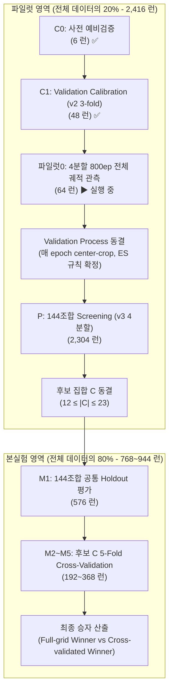

# 랩미팅 발표 및 프로토콜 이해 자료

교수님의 지시사항과 첨부 프로토콜 문서를 바탕으로 정리한 발표 자료 및 핵심 가이드라인입니다.

---

## [1] 쉬운 말 정리 (초보용, 한국어)

### 1. 한 문장 요약

이 연구는 144개 모델 조합(헤더 12종 × 백본 12종)의 성능을 4개 과수 데이터셋에서 평가할 때, 전체 데이터의 **20% 파일럿 영역**에서 사전에 동결된 검증 절차(validation process)로 유망 후보 C(12~23개)를 먼저 선별한 뒤, 본실험(80% 영역)에서 공통 M1 holdout(전체 144조합)과 5-fold OOF(C 후보군)를 단계적으로 평가하여 최적의 모델을 확증하는 실험 설계입니다.

---

### 2. 2026-09-11 에 바뀐 것과 그 전의 차이

| 구분 | 2026-09-11 변경 전 (v2 기준) | 2026-09-11 변경 후 (v3 현행 기준) | 변경 사유 및 영향

 |
| --- | --- | --- | --- |
| **파일럿 내부 분할**<br> | **3-fold**<br> | **4분할 (4회전)**<br> | 검증 fold(t+1)와 시험 fold(t)를 명확히 분리하여, 체크포인트 선택용 검증과 성능 산출용 시험의 독립성 확보.

 |
| **파일럿 회전 구조**<br> | 단순 3-fold CV

 | **학습 2 : 검증 1 : 시험 1** 순환 회전

 | 회전당 학습 표본 비율이 2/3에서 2/4(50%)로 변경됨.

 |
| **파일럿0 (Pilot-0) 단계**<br> | C1 (300 epoch 완주, 48런) 중심

 | **800 epoch 완주 (64런) 신설·진행**<br> | 긴 학습 예산에서 검증·시험 궤적 및 자원 소비량을 정밀 관측하기 위함.

 |
| **데이터 분할 파일 (v3)**<br> | `v2_seed3407`<br> | `v3_seed3407`<br> | 20/80 소속 및 본실험 5-fold는 v2와 완전히 동일하게 유지하고 파일럿 내부 fold만 재배정.

 |

---

### 3. 데이터를 어떻게 나누는지

* **전체 분할 원칙**: 데이터는 20% 파일럿(P)과 80% 본실험(M)으로 단 한 번 분할되며, 파일럿 데이터는 본실험의 학습이나 시험에 절대 재사용되지 않습니다.


* **누출 방지 (Group Preservation)**: 같은 나무, 촬영 장면, 인접 프레임(카메라 N, 비디오 M, 사과 capture-sequence 등)은 반드시 같은 fold로 격리 배정합니다.


#### 데이터셋 4개 장수 및 분할 상세 표

| 데이터셋 | 출처 | 전체 장수 | 파일럿 20% | 파일럿 회전당 (학습 / 검증 / 시험) | 본실험 80% | 본실험 1회당 (학습 64% / 시험 16%) | 비고

 |
| --- | --- | --- | --- | --- | --- | --- | --- |
| **블루베리**<br> | 자체 수집

 | **1,195**<br> | 239

 | 119~120 / 59~60 / 59~60

 | 956

 | 765 / 191

 | 카메라 4대 단위 그룹 분할

 |
| **사과**<br> | MinneApple

 | **1,001**<br> | 200

 | 82~118 / 41~66 / 41~66

 | 801

 | 641 / 160

 | 촬영 시퀀스 보존으로 fold 장수 불균등

 |
| **복숭아**<br> | 자체/수집

 | **125**<br> | 25

 | 12~13 / 6~7 / 6~7

 | 100

 | 80 / 20

 | 소표본 데이터셋 (가중치는 동일 유지)

 |
| **포도**<br> | CERTH

 | **2,502**<br> | 500

 | 250 / 125 / 125

 | 2,002

 | 1,602 / 400

 | 공개 데이터셋

 |

---

### 4. 단계 순서와 각 단계의 결정 권한 (Scope of Decisions)

```
C0 → C1 (이력) → 파일럿0 → validation 동결 → P (Screening) → C 동결 → M1 → M2~M5

```

1. **C0 (사전 예비검증)**

* **결정하는 것**: calibration 코드 구현 및 조기종료(ES) 후보 규칙 1차 타당성 확인.


* **결정하면 안 되는 것**: 공통 학습 설정, 모델 우열 판정.


2. **C1 (Validation Calibration — v2 이력, 완료)**

* **결정하는 것**: 매-epoch 센터크롭 궤적 관측을 통한 early stopping 규칙 수립 및 조기 중단에 따른 후회값(regret) 관측.


* **결정하면 안 되는 것**: 본실험 모델 선정, 손실함수·학습률 등 공통 Hyperparameter 변경.


3. **파일럿0 (Pilot-0 — 현행 실행 중)**

* **결정하는 것**: 800 epoch 장기 학습 시 검증/시험 궤적, 자원 소비량 정밀 실측 데이터 확보.


* **결정하면 안 되는 것**: ❌ **시험 fold 점수로 epoch나 hyperparameter를 고르면 안 됨** (문서에 시험 궤적으로 설정을 고르지 않는다고 명시됨). (이 단계의 구체적 결정 권한은 현재 **문서에 없음 / 미정**)


4. **validation 동결 (Validation Process Freeze)**

* **결정하는 것**: 매 epoch 센터크롭 validation 및 체크포인트 선택 기준, 조기종료 규칙 확정.


* **결정하면 안 되는 것**: 이후 본실험 단계에서 validation 규칙을 수정하는 행위.


5. **P (Pilot Screening — 2,304 런)**

* **결정하는 것**: 동일 설정하에 144조합을 평가하여 **후보 집합 C (12~23개) 선별**.


* **결정하면 안 되는 것**: 공통 학습 설정 수정, C 외의 조합 변경.


6. **C 동결 (Candidate C Freeze)**

* **결정하는 것**: 본실험 5-fold 추가 평가를 진행할 C 조합 목록 최종 고정.


* **결정하면 안 되는 것**: M1 본실험 결과를 본 뒤 C 목록을 수정/추가/삭제하는 행위.


7. **M1 (Full-grid Holdout Evaluation — 576 런)**

* **결정하는 것**: 144개 전체 조합의 독립 공통 holdout(M1)에서의 성능 matrix, 주효과, 상호작용 및 **Full-grid winner** 결정.


* **결정하면 안 되는 것**: M1 결과를 바탕으로 후보 C의 목록을 재조정하는 행위.


8. **M2~M5 (Cross-validation Confirmation — 192~368 런)**

* **결정하는 것**: 선별된 후보 C의 5-fold cross-validation 안정성 확인 및 **Cross-validated winner** 확정.


* **결정하면 안 되는 것**: C에 속하지 않은 나머지 조합에 대해 M2~M5를 추가 수행하는 행위.


---

### 5. P 에서 후보 C 를 고르는 규칙

* **선별 기준**: 파일럿 4분할의 **시험 fold** image-macro Dice 점수의 4개 데이터셋 단순 평균(동일 가중)으로 산출.


* **후보 집합 정의**: $C = A \cup B$

* $A$: 헤더(Decoder) 12종 각각에서 성능이 가장 높은 top-1 백본 (12개)


* $B$: 백본(Backbone) 12종 각각에서 성능이 가장 높은 top-1 헤더 (12개)


* **크기 범위**: **$12 \le \vert{}C\vert{} \le 23$**

* 헤더와 백본이 12종씩이므로 $A$와 $B$는 각각 최소 12개입니다. 전체 최고 조합은 $A \cap B$에 반드시 포함되므로, 합집합 $A \cup B$의 크기는 최소 12개에서 최대 23개가 됩니다. (동점 발생 시 candidate ID 사전순 정렬).


---

### 6. 승자가 둘인 이유 (Full-grid winner vs Cross-validated winner)

* **Full-grid winner**: 144개 전체 조합을 공통 holdout 데이터셋인 `M1`에서 똑같이 단일 평가했을 때 1위를 한 조합. (계산 자원의 한계로 144개 전체에 5-fold를 수행할 수 없으므로 전체 구도를 파악하는 용도).


* **Cross-validated winner**: 파일럿에서 엄격히 선별된 유망 후보군 C에 대해 `M1~M5` 전체 5-fold OOF(Out-of-Fold) cross-validation을 완주했을 때 1위를 한 조합.


* **이유**: 단일 holdout 평가(`M1`)에서 발생하는 분할 편향(split variance)을 극복하고, 일반화 성능과 안정성이 검증된 조합을 실무적 최종 권장 모델(Cross-validated winner)로 제시하기 위함입니다.


---

### 7. Test 평가 방법

* **슬라이딩 윈도우 (Sliding Window)**:


* 입력: 원본 해상도 전체 영상 (Test-time resizing 안 함)


* Window 크기: $512 \times 512$, Stride: $384$ (Overlap 25%)


* Padding: 512 미만 영상은 우측/하단 padding 적용하되, padding 영역은 평가에서 제외


* 결합: Probability(sigmoid) 또는 logit 단순 평균 (Threshold 0.5 고정, TTA 및 후처리 없음).


* **평가 지표 (Metrics)**:


* **주 지표 (Primary)**: **image-macro Dice** (각 영상별 Dice 산출 후 전체 평균)


* Secondary: image-macro IoU


* 경계/객체 지표: Boundary F-score, 객체 수준 Precision/Recall/F1 (사과 인스턴스 ID 활용)


* **통계 분석 (Statistics)**:


* 독립 블록 수: **$N = 4$ (데이터셋 4개)**. (같은 데이터셋의 fold를 독립 블록으로 세지 않음).


* 주 분석: **Paired 비교 + 다중비교 보정(Holm 등)**. (Friedman 검정은 보조적 수단).


---

### 8. 아직 안 정해진 것 목록 (Pending)

1. **미결 13**: VMamba-T 버전 동결 (config·commit·checkpoint hash)


2. **문헌 검색 Cutoff 날짜**: 문서상 🟡 미확정 (실제 조사는 2026-09-05까지 수행)


3. **Seed 관련**: 🟡 미확정 (분할 seed, 학습 seed 개수 및 값, window bank 좌표 seed)


4. **학습 Hyperparameters**: Weight decay, Warm-up 범위, Gradient clipping, 백본 대비 head의 LR multiplier, Batch Normalization 처리 (Freeze/Sync BN)


5. **최대 Optimizer Update 수 예산**: 🔴 Pending


6. **실패 판정 명세**: OOM, NaN, 발산, weight 로딩 실패 시 허용 재시작 횟수


7. **Inference batch size 및 효율 측정 반복 횟수**: 🟡 Pending (warm-up 및 latency 반복 횟수 미정)


8. **파일럿0 단계의 권한 범위**: 🟡 미정 (이 단계 결과로 무엇을 최종 결정할지에 대한 권한 미확정)


9. **자원/저장량 재산정**: 🔴 12×12 확대에 따른 GPU-h 및 checkpoint 저장량 재산정 필요


---

### 9. 논문에 쓰면 안 되는 표현 5개

1. ❌ **"전수조사 (exhaustive survey)"** $\rightarrow$ 검색식 문자열이 보존되지 않았으므로 **"candidate audit"** 또는 "scoping review"로 표기.


2. ❌ **"전체 데이터의 5-fold cross-validation"** $\rightarrow$ 20% 파일럿이 완전 격리되었으므로 "20% exclusive pilot; all 144 configurations on a common independent M1 holdout from the main 80%; pilot-selected C confirmed with five-fold OOF"로 명시.


3. ❌ **"모델 수를 줄여 통계 검출력을 높였다"** $\rightarrow$ 후보 C 축소는 계산량, 축 대표성, 설명 단순성을 위함이지 통계 검출력 개선이 아님.


4. ❌ **"블루베리 데이터셋 1,089장"** $\rightarrow$ 서버 근거 없음. 원본은 **1,195장** (1,067 리사이즈 + 128 제외)이 맞음.


5. ❌ **"센터크롭 평가에서 모든 데이터셋에 identical 12.6% 공정성 적용"** $\rightarrow$ 센터크롭 내 과실 포착률이 데이터셋별로 22.7%~60.7%로 2.7배 차이나므로 공정성 논거로 사용 불가.


---

## [2] 순서도 (Mermaid Flowchart)



> **신규 전체 런 수 합계**: **3,184 ~ 3,360 런** (완료된 C0 6 런 제외, C1 48 런 + 파일럿0 64 런 + P 2,304 런 + M1 576 런 + M2~M5 192~368 런)
> 
> 

---

## [3] 5분 발표 대본

### [00:00 - 00:40] 1. 개요 및 연구 목적 (소요 시간: 40초)

안녕하세요. 데이터사이언스 전공 곽동신입니다. 오늘 랩미팅에서는 저희 랩에서 진행 중인 '4종 과수 영상 분할을 위한 144개 딥러닝 모델 조합의 엄격한 벤치마크 평가 프로토콜'에 대해 설명해 드리겠습니다.
저희의 목표는 헤더(Header, 즉 세그멘테이션 디코더) 12종과 백본(Backbone, 특징 추출기) 12종을 교차한 총 144개 그리드 조합 중에서, 다양한 과실 환경에 가장 강건한 최적의 모델을 선별하는 것입니다. 본 실험 설계는 엄격한 데이터 격리와 단계별 동결 원칙을 준수하도록 설계되었습니다.

---

### [00:40 - 01:40] 2. 데이터 분할 및 파일럿의 지위 (소요 시간: 60초)

데이터 분할 구조부터 말씀드리겠습니다. 저희는 데이터 누출(Data Leakage)을 완벽히 차단하기 위해 전체 데이터의 20%를 **파일럿(Pilot)** 영역으로 사전 격리하고, 나머지 80%를 **본실험(Main)** 영역으로 지정했습니다.
이때 파일럿 20% 영역은 오직 탐색적 목적, 즉 모델 후보군을 좁히기 위한 용도로만 사용되며, 본실험의 학습이나 시험에 절대 재사용되지 않습니다. 또한, 동일한 카메라나 촬영 시퀀스에서 나온 영상이 서로 다른 fold로 쪼개지지 않도록 그룹 분할(Group Split)을 적용했습니다.
최근 9월 11일 자로 바뀐 핵심 변경 사항은 파일럿 내부 분할 방식입니다. 기존 3-fold 방식에서 **4분할(4회전)** 방식으로 개편하여, 검증 fold와 시험 fold를 완전히 분리함으로써 체크포인트 선택과 평가의 독립성을 확보했습니다.

---

### [01:40 - 03:00] 3. 파일럿 단계 및 후보 C 선별 규칙 (소요 시간: 80초)

다음은 파일럿 단계에서의 검증 절차입니다.
현재 저희는 대표 2×2 조합에 대해 800 epoch를 완주하는 **파일럿0(Pilot-0)** 64개 런을 실행 중입니다. 이 과정에서 매 epoch 센터크롭(Center-crop, 이미지 중앙 512×512 영역) 검증 궤적을 관측하여, 조기종료(Early Stopping) 규칙 및 체크포인트 선택 프로세스를 완전히 동결하게 됩니다.
이 검증 프로세스가 동결되면, 144개 전 조합을 대상으로 파일럿 4분할 screening 2,304 런을 수행합니다. 여기서 후보 C를 선별하는데, 규칙은 매우 명확합니다. 각 헤더별 top-1 백본 12개를 모은 집합 A와, 각 백본별 top-1 헤더 12개를 모은 집합 B의 합집합($A \cup B$)으로 결정합니다. 이에 따라 후보 C의 개수는 최소 12개에서 최대 23개로 제한됩니다. 이 단계가 끝나면 후보 C 목록은 완전히 잠기게 됩니다.

---

### [03:00 - 04:10] 4. 본실험 수행 및 최종 승자 선정 (소요 시간: 70초)

후보 C가 동결된 후 본실험 80% 영역으로 진입합니다.
본실험에서는 두 가지 승자를 구분하여 산출합니다.
첫째, 144개 전체 조합을 본실험의 공통 독립 데이터셋인 `M1` holdout에서 똑같이 평가하여 **Full-grid winner**를 뽑습니다. 이는 전체 144개 조합의 대략적인 순위와 구조적 상호작용을 파악하기 위함입니다.
둘째, 파일럿에서 선별된 유망 후보 C에 한해서만 나머지 `M2`부터 `M5`까지 5-fold Cross-Validation을 완주하여 **Cross-validated winner**를 확정합니다.
최종 논문 및 실무 권장 모델은 단일 분할 편향을 극복한 Cross-validated winner가 되며, 이때 최종 test 평가 지표는 센터크롭이 아닌, 원본 해상도 전체 영상을 겹침 슬라이딩 윈도우(Sliding Window)로 추론한 **image-macro Dice**를 사용합니다.

---

### [04:10 - 05:00] 5. 설계가 답하려는 핵심 질문 4개 및 마무리 (소요 시간: 50초)

마지막으로, 교수님의 이 실험 설계가 답하고자 하는 핵심 질문 4가지는 다음과 같습니다.

1. **144개 대표 헤더×백본 조합 중 4종 과수 환경 전반에서 가장 높은 분할 성능을 보이는 최적의 조합(Cross-validated winner)은 무엇인가?**

2. **헤더(Decoder)와 백본(Backbone)의 주효과(Main Effect)와 두 축 간의 상호작용(Interaction)이 과실 세그멘테이션 성능에 어떤 영향을 미치는가?**

3. **20% 파일럿 영역에서 사전에 정한 규칙으로 후보 C를 선별하는 방식이 본실험 전체 grid의 상위 모델들을 놓치지 않고 안정적으로 포착해 내는가?**

4. **입력 해상도, 연산량(FLOPs), 파라미터 수 등 하드웨어 효율성과 과실 세그멘테이션 정확도 간의 현실적인 트레이드오프는 어떠한가?**


이상으로 발표를 마치겠습니다. 질문 있으시면 답변해 드리겠습니다. 감사합니다.

---

## [4] 교수님이 물어볼 만한 질문 10개와 답

### Q1. 왜 파일럿 20%를 떼어내고, 본실험 데이터와 섞어서 5-fold를 돌리지 않습니까?

**답**: 파일럿 데이터가 본실험 학습이나 검증에 섞이면 모델 후보군 선별 과정에서 본실험 정보가 흘러 들어가는 정보 누출(Data Leakage)이 발생합니다. 파일럿 결과를 본 후 실험 설정을 정하는 행위(결과 의존적 선택)를 엄격히 차단하고, 확증적 본실험의 신뢰성을 확보하기 위해 20%를 완전 격리하였습니다.
*(근거: `260905_00_프로토콜_관리원칙.md` §1, 결정 12)*

### Q2. 후보군 C의 개수가 왜 하필 12개에서 23개 사이로 제한됩니까?

**답**: C는 헤더 12종 각각의 top-1 백본 집합 A(12개)와, 백본 12종 각각의 top-1 헤더 집합 B(12개)의 합집합($A \cup B$)입니다. 각 축이 12개이므로 최소 12개이며, 전체 1위 조합은 반드시 A와 B의 교집합($A \cap B$)에 포함되므로 합집합의 최대 크기는 23개가 됩니다.
*(근거: `260905_00_프로토콜_관리원칙.md` 결정 15, `260906_파일럿_단계_및_결정규칙.md` §4)*

### Q3. 복숭아 데이터셋은 125장밖에 안 되는데, 1/4 가중치를 동일하게 주면 선별이 왜곡되지 않습니까?

**답**: 가중치를 수동으로 변경하면 그 자체가 또 다른 하이퍼파라미터가 되어 평가의 중립성을 해칩니다. 따라서 가중치는 4개 데이터셋 모두 1/4로 동일하게 유지하되, 복숭아 순위와 나머지 3개 데이터셋 순위 간의 켄달 타우(Kendall's $\tau$) 상관계수를 계산하여 순위 보존성을 별도로 보고하고 논문 한계점(Limitation)에 명시합니다.
*(근거: `260905_00_프로토콜_관리원칙.md` 결정 19, `260905_06_시험_평가_및_보고.md` §4)*

### Q4. 9월 11일에 파일럿 내부 분할을 3-fold에서 4분할로 바꾼 구체적 이유가 뭡니까?

**답**: 파일럿 안에서 체크포인트를 선택하기 위한 검증 fold($t+1$)와 실측 성능을 계산하는 시험 fold($t$)를 완전히 분리하기 위함입니다. 4분할 순환 구조를 적용함으로써 모든 fold가 검증과 시험에 한 번씩 쓰이면서도 데이터 오염 없이 정밀한 screening이 가능해졌습니다.
*(근거: `260905_00_프로토콜_관리원칙.md` 결정 29, `260906_파일럿_단계_및_결정규칙.md` 개요)*

### Q5. C1 단계와 파일럿0 단계에서 나온 대표 2×2 모델들의 점수를 나중에 본실험 점수로 재사용합니까?

**답**: 절대 재사용하지 않습니다. C1과 파일럿0은 오직 센터크롭 기반의 검증 프로세스 및 Early Stopping 규칙을 확정하기 위한 용도입니다. 이 단계가 끝나면 동일한 2×2 모델도 본실험 Screening에서 새로운 random seed로 다시 학습시킵니다.
*(근거: `260905_00_프로토콜_관리원칙.md` 결정 14, `260906_파일럿_단계_및_결정규칙.md` §3)*

### Q6. Full-grid winner와 Cross-validated winner가 서로 다르게 나오면 어떻게 해석하고 보고해야 합니까?

**답**: 두 승자가 다를 경우, 단일 holdout 분할(`M1`)이 가지는 분할 의존성과 데이터셋 간 이질성(Heterogeneity) 때문으로 해석합니다. 보고 시에는 pilot에서 선별된 C가 M1 top-k를 얼마나 포착했는지 비율을 제시하고, 5-fold OOF로 안정성이 검증된 Cross-validated winner를 최종 권장 모델로 제시합니다.
*(근거: `260905_06_시험_평가_및_보고.md` §4-2, `260906_파일럿_단계_및_결정규칙.md` §5)*

### Q7. 왜 학습·검증 시에는 512×512 센터크롭을 쓰고, 최종 test 평가에서는 슬라이딩 윈도우를 씁니다?

**답**: 센터크롭은 학습 속도를 높이고 조기종료 신호를 관측하기 위한 저비용 대리 지표(Proxy)입니다. 실측 결과 센터크롭 내 과실 포착률이 사과 22.7%, 복숭아 60.7% 등 편향이 심하므로, 최종 성능 평가에서는 원본 해상도를 전체 커버하는 $512 \times 512$ (stride 384) 슬라이딩 윈도우 추론을 적용해야 공정합니다.
*(근거: `260905_05_학습_및_검증.md` §4, `260905_06_시험_평가_및_보고.md` §1)*

### Q8. 이미지에 과일이 하나도 없는 빈 전경(Background-only)이 나올 때 Dice 손실이나 지표 처리는 어떻게 합니까?

**답**: 전체 영상 평가 기준 4,823장 전수 조사 결과 전경이 0인 영상은 0장(0.0%)으로 최종 지표 평가 시 $0/0$ 문제는 발생하지 않습니다. 다만 학습 과정에서 512 crop 시 sampling에 의해 빈 전경 crop이 생길 수 있으므로, Ground Truth와 예측이 모두 빈 경우 Dice=1, 한쪽만 빈 경우 Dice=0 규칙을 적용합니다.
*(근거: `260905_00_프로토콜_관리원칙.md` §4, `260905_06_시험_평가_및_보고.md` §3)*

### Q9. 144개 조합 전체에 대해 5-fold Cross-Validation을 다 안 돌리고 C에 대해서만 돌리는 이유가 뭡니까?

**답**: 144개 조합 전체에 5-fold를 수행하려면 약 3,600회 이상의 대규모 런이 필요하여 연산 자원 예산을 초과합니다. 따라서 공통 holdout(`M1`)으로 전체 144개 조합의 대략적 지형을 파악하고, 파일럿에서 검증된 C에 연산을 집중하여 계산 효율성과 확증적 검증의 엄격성을 동시에 확보한 절충 설계입니다.
*(근거: `260905_00_프로토콜_관리원칙.md` 결정 25)*

### Q10. 통계 분석에서 Friedman 검정을 주 분석으로 사용하지 않는 이유는 무엇입니까?

**답**: Friedman 검정에서 독립적인 블록 수($N$)는 과수 데이터셋 수인 **4개**에 불과합니다. 동일 데이터셋 내의 fold를 독립된 블록으로 세는 것은 통계적 오류(False Independence)이므로, 데이터셋 4개만으로는 통계적 검출력이 낮아 Paired 비교 및 다중비교 보정(Holm 등)을 주 분석으로 사용하고 Friedman은 보조 수단으로만 활용합니다.
*(근거: `260905_00_프로토콜_관리원칙.md` 결정 18, `260905_06_시험_평가_및_보고.md` §4-3)*
