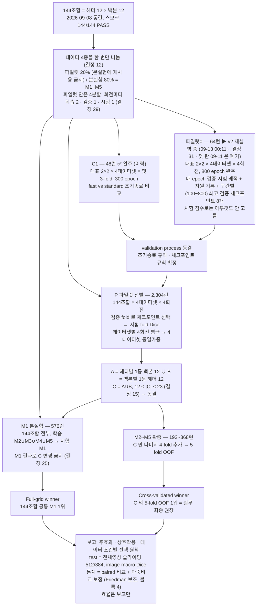

작성: 2026-09-12
작성자: 곽동신 (서버 클로드 정리)
용도: 2026-09-15 랩미팅에서 곽동신이 "이해한 바대로" 실험 설계를 설명하기 위한 순서도 + 대본 **2판**
1판과 다른 점: 교수님이 2026-09-11 에 바꾸신 결정 29(파일럿 4분할)·30(파일럿0 64런 800 epoch)을 반영. 런 수 1,728 → 2,304, 합계 3,072~3,248. C1 은 "이력". 1판(260908_실험설계_순서도.md·svg·png)은 쓰지 말 것.
근거: platform/planning/안내.md(09-11) · 260905_00 결정 12·14~16·19·20·24~30 · 260906_파일럿_단계_및_결정규칙.md(09-13) · 04_experiments/260911_파일럿0/README.md
그림: 같은 폴더 260912_실험설계_순서도_2판.svg (편집 가능) · .png (슬라이드용)
최종 수정: 2026-09-13 12시 30분 — 독립 감사(에이전트 87개, 확정 지적 27건) 반영: 마무리 런 수 합계 정정·"어제"→"그저께 일요일"·mermaid 파일럿0 상자 v2·완주 예상 오후 1~4시·근거 판 날짜. 12시 — 🔴 교수님이 09-13 00:11 에 파일럿0 64런을 v2 로 전부 재실행(결정 31: epoch 100·200·…·800 구간별 최대 검증 체크포인트 저장). 첫 판(32런 완주)은 폐기·보존. v2 진행 8/64, 완주 예상 09-14(월) 오후 1시~4시(런당 부대시간 14분·조합별 실측 속도 반영, 마지막 GPU 약 16시). 요일 오류 정정(09-11 = 금요일, 09-15 랩미팅 = 화요일). O-1 슬라이딩 추론 코드는 "있음"으로 정정. (09-12 18시 판: 외부 AI 4개 대조 반영 6곳 · 09-12 19:45 판: 첫 판 중간 집계)

# 실험 설계 순서도 2판 — 파일럿 → 선별 → 본실험

## 1. 그림 (mermaid)

런 수: P 2,304 + M1 576 + M2~M5 192~368 = **3,072~3,248런**. C1 48 + 파일럿0 64 포함 3,184~3,360. C0(옛 6런)은 별도.

## 2. 발표 대본 (5분, 쉬운 말)

### 왜 이렇게 하나 (30초)
- 헤더 12개와 백본 12개를 전부 짝지으면 144개 조합입니다. 4개 데이터셋에서 5-fold 로 다 돌리면 2,880런이라 못 합니다.
- 그래서 "작은 데이터로 먼저 거르고, 전체 데이터는 한 번만 돌리고, 유망한 것만 다섯 번 돌린다"는 3단계 설계입니다.

### 1단계 — 데이터를 둘로 나눈다 (40초)
- 각 데이터셋을 20%와 80%로 한 번만 나눕니다. 20%는 파일럿, 80%는 본실험입니다. 파일럿은 본실험에 절대 다시 안 씁니다. 고르는 데이터와 평가하는 데이터를 분리하는 게 핵심입니다.
- 블루베리로 치면 파일럿 239장, 본실험 956장입니다. 본실험은 다시 M1~M5 다섯 조각입니다.
- 바뀌지 않은 것도 말씀드리면, 20%·80% 소속과 본실험 M1~M5, 그룹 묶음은 그대로이고 파일럿 안쪽만 다시 나눴습니다.
- 파일럿 안은 지난 금요일(09-11)에 4분할로 바뀌었습니다. 회전마다 학습 2조각, 검증 1조각, 시험 1조각입니다. 검증은 체크포인트를 고르는 데, 시험은 점수를 재는 데 씁니다. 3-fold 때는 검증 하나로 둘 다 했는데 이제 분리됐습니다. 데이터셋당 4회전이라 모든 조각이 시험 한 번, 검증 한 번 쓰입니다.

### 2단계 — 언제 멈출지 정한다: C1 과 파일럿0 (60초)
- 2,304런을 돌리기 전에 "몇 epoch 에서 멈출지"를 정해야 합니다. 대표 4쌍으로만 미리 재는 단계입니다. 대표는 고전 디코더 BackboneUNet 과 최신 디코더 VWFormer, CNN 백본 ResNet-50 과 Transformer 백본 MiT-B2 를 교차한 4쌍입니다.
- C1 은 옛 3-fold 로 48런을 300 epoch 끝까지 돌린 것이고 지난주에 끝났습니다. 결과는 fast 규칙(40 지나고 10 epoch 안 좋아지면 멈춤)이 standard(80 지나고 40)보다 놓친 IoU 가 중앙값 0.0085 로 작지만, 복숭아 한 런에서는 0.604 로 컸습니다. 작은 데이터셋은 늦게 좋아집니다.
- 그래서 교수님이 파일럿0 를 추가하셨습니다. 같은 4쌍을 새 4분할로 64런, 800 epoch 까지 끝까지 돌리면서 매 epoch 검증과 시험 점수를 둘 다 기록합니다. 그리고 그저께 일요일(09-13) 새벽 0시 11분에 64런을 전부 다시 시작하셨습니다(결정 31). 첫 판은 best 와 800 epoch 체크포인트 두 개만 남겨서 "몇 epoch 예산까지 하면 성능이 유지되는가"를 판정할 가중치가 없었기 때문입니다. 새 판은 100, 200, … 800 epoch 경계마다 그 구간까지의 최고 검증 모델을 따로 저장합니다(런당 8개). 그 체크포인트들을 나중에 전체 영상 슬라이딩으로 한 번씩 평가해서 예산을 정합니다. 어제(09-14) 오후에 64런이 [★ 발표 전 확인: 서버 클로드에게 "파일럿0 집계" 요청 → "모두 끝났습니다 / ○○런 끝났습니다" 로 채울 것] . 시험 점수는 기록만 하고 아무것도 고르지 않습니다. (일요일 정오 시점 진행은 8/64, 완주 예상은 월요일(09-14) 오후 1시에서 4시 사이(마지막 GPU 약 오후 4시) 였습니다.)
- 여기서 나온 성적은 후보 고르는 데 안 씁니다. 파일럿0 는 멈춤 규칙과 체크포인트 규칙을 동결할 재료를 모으는 단계이고, 이걸로 정확히 무엇을 결정할지는 교수님 문서에 아직 "미정"으로 돼 있습니다.

### 3단계 — P: 파일럿으로 거른다 (60초)
- 144조합을 파일럿 안에서 4회전 돌립니다. 144 × 4 × 4 = 2,304런입니다.
- 회전마다 검증 조각으로 체크포인트를 고르고, 시험 조각의 Dice 로 점수를 냅니다. 데이터셋마다 4회전 평균, 4개 데이터셋은 똑같은 무게로 평균합니다. 포도가 2,502장이라고 점수를 지배하면 안 되니까요. 속도나 메모리는 점수에 안 넣습니다.
- 고르는 규칙은 두 줄입니다. A = 헤더마다 가장 잘 맞는 백본 하나, B = 백본마다 가장 잘 맞는 헤더 하나, C = A 와 B 를 합친 것. 헤더 12개와 백본 12개가 전부 최소 한 번씩 들어가고, 겹치니까 12개에서 23개 사이입니다.
- 파일럿이 끝나면 C 를 잠급니다.

### 4단계 — M1: 전체를 한 번 (30초)
- 144조합 전부를 본실험 80%로 한 번씩 돌립니다. M2~M5 로 학습하고 M1 로 시험합니다. 576런입니다. 모든 조합이 같은 시험지를 풉니다. M1 결과를 보고 C 를 바꾸면 안 됩니다.

### 5단계 — M2~M5: 유망한 것만 다섯 번 (30초)
- C 에 든 12~23개만 나머지 4개 fold 를 더 돌립니다. 16 × |C| = 192~368런입니다.
- 승자가 둘 나옵니다. Full-grid winner 는 144개 전체의 M1 1등, Cross-validated winner 는 C 안의 5-fold 1등입니다. 최종 권장은 후자입니다. 둘이 다르면 왜 다른지를 보고합니다.

### 마무리 (20초)
- 벤치마크 런 수는 3,072~3,248런입니다(P 2,304 + M1 576 + M2~M5 192~368). 여기에 C1 48 과 파일럿0 64 를 더한 신규 전체는 3,184~3,360런이고, 파일럿 쪽이 2,416런, 본실험 쪽이 768~944런입니다. 144개를 그냥 5-fold 로 다 돌리면 2,880런인데, 그 대신 이 설계는 후보 C 에만 5-fold 를 씁니다. test 는 전체 영상 슬라이딩 윈도우로 한 번만 평가하고, 통계는 짝지은 비교에 다중비교 보정, 블록은 데이터셋 4개입니다.
- 이 설계가 답하는 질문은 넷입니다. 어떤 조합을 추천할 것인가, 좋은 백본은 디코더가 바뀌어도 좋은가, 성능이 부품의 합인가 궁합인가, 최신 기법의 이득이 작고 빽빽하고 겹친 과실에서도 재현되는가.

## 3. 예상 질문과 답

### 3-0. 발표 끝에 교수님께 여쭤볼 것 4개 (문서끼리 어긋나는 곳 — "이해한 바대로" 설명하면서 확인받기)
1. **결정 13(VMamba-T 동결) 상태** — 안내.md 표에는 "13 미결"인데 00 문서 §4 에는 "해소(v2 s1l8, SHA-256, backend 동결)"로 돼 있습니다. 정본 규칙(충돌 시 00 우선)대로 해소로 이해했는데 맞는지.
2. **P 선별 점수를 재는 fold** — 결정 16·파일럿 문서 §4 는 "시험 fold Dice(체크포인트는 검증 fold)"인데 00 §1 본문은 "파일럿 validation Dice"라고 돼 있습니다. 4분할 이후 시험 fold 가 맞다고 이해했습니다.
3. **복숭아 파일럿 학습 장수** — 01 문서 §3 은 회전당 12~13장(v3 실측)인데 06 문서 §4 는 "약 17장"(3-fold 시절)입니다. 12~13 이 현행이라고 이해했습니다.
4. **파일럿0 로 무엇을 결정하나** — 파일럿 문서 §1 표에는 "미정, 사용자 확정 필요"로 남아 있는데, 09-13 결정 31 은 "몇 epoch 예산까지 하면 성능이 유지되는가를 구간별 체크포인트의 전체영상 슬라이딩 시험 지표로 판정한다"고 적혀 있습니다. 그래서 파일럿0 의 결정 사항 = ① epoch 예산(100~800 중 어디까지) ② 조기종료·체크포인트 규칙, 이렇게 이해했는데 맞는지. §1 표의 "미정"은 낡은 것인지.

### 3-1. 설계 질문

- "3-fold 를 왜 4분할로 바꿨나" → 파일럿 안에서 체크포인트 고르는 데이터와 점수 재는 데이터를 분리하려고요(결정 29). 대신 회전당 학습 표본이 파일럿의 2/3 에서 2/4 로 줄었습니다. 복숭아는 회전당 학습 12~13장입니다.
- "파일럿0 로 뭘 정하나" → 결정 31(09-13)로 목적이 분명해졌습니다. epoch 100, 200, … 800 경계마다 그 구간까지의 최고 검증 모델을 저장해 두고, 나중에 전체 영상 슬라이딩으로 한 번씩 평가해서 "몇 epoch 예산이면 충분한가"를 정합니다. 매 epoch 시험 점수는 센터크롭 모니터링일 뿐 프로토콜 지표가 아닙니다. 조기종료 규칙과 체크포인트 규칙도 여기서 확정한 뒤 P 전에 동결한다고 이해했습니다.
- "파일럿0 중간 결과는" → [★ 09-14 저녁 집계로 갱신할 것. 아래는 일요일 정오 8/64 기준] 포도 MiT-B2 두 조합(BackboneUNet·VWFormer × 4회전) 8런 기준으로, 구간별 체크포인트의 센터크롭 시험 Dice 가 100 epoch 예산 0.939~0.957 에서 800 epoch 예산 0.944~0.956 으로 차이가 최대 0.006 입니다. 즉 포도 MiT-B2 는 100 epoch 뒤 이득이 거의 없습니다. 다만 센터크롭 값이고 프로토콜 판정은 전체영상 슬라이딩으로 다시 합니다. 첫 판(폐기)에서는 블루베리 best 가 728·740 처럼 늦게 나온 회전이 있어 데이터셋마다 다를 수 있습니다.
- "C1 은 버리나" → 아닙니다. 이력으로 보존합니다. 다만 3-fold 라 학습 표본 비율이 다르고 epoch 예산도 달라서 4분할 수치와 직접 비교하지 않습니다.
- "2,304런은 얼마나 걸리나" → ❌ 아직 추정도 못 합니다. 교수님도 "C1·파일럿0 실측으로 재산정"이라 두셨습니다. 파일럿0 가 끝나면 800 epoch 실측이 나오니 그때 계산합니다. 참고로 파일럿0 64런은 약 262 GPU시간 추정이었습니다.
- "지금 실행을 막고 있는 건" → 파일럿0 v2 완주(월요일 낮)와 그 뒤 validation process 동결입니다. 코드는 슬라이딩 윈도우 추론이 파일럿0 코드 폴더에 생겼고(O-1 ✅, 다만 03_code 에는 미반영), 평가 증강 함수의 두 분기가 모두 CenterCrop 인 문제(O-9, augmentations.py:340)와 foreground-aware sampling(O-6)이 아직 없습니다. 그리고 파일럿 이후 단계의 GPU 시간이 전부 재산정 대상입니다.
- "아직 안 정해진 설정은" → weight decay, warm-up 길이, 최대 update 수(복숭아와 포도가 20배 차이라 epoch 대신 update 로 맞출지), seed 개수, BN 처리, gradient clipping, 실패 판정. 전부 P 전에 동결합니다.
- "test 는 어떻게 평가하나" → 전체 영상 슬라이딩 윈도우 512, stride 384, threshold 0.5 고정, TTA·후처리 없음. 영상 단위 Dice. test 는 프로토콜과 C 가 동결된 뒤에만 엽니다. 센터크롭은 과실의 75~77% 를 못 봐서 최종 평가엔 안 씁니다.
- "왜 144개를 5-fold 다 안 하나" → 2,880런이라서요. 대신 144개 전부 M1 에서 같은 시험을 보고 C 만 5-fold 로 확증합니다. 논문엔 "전체 5-fold"라고 쓰지 않습니다.
- "C 를 줄인 이유가 통계 검출력인가" → 아닙니다. 계산량·두 축 대표성·설명 단순성입니다.
- "파일럿 성적으로 고르면 결과 의존 아닌가" → 파일럿 20%는 본실험에서 완전히 빠져 있습니다. 후보 144개 자체는 성능 없이 문헌·구조·재현성으로 골랐습니다.
- "복숭아 125장은 너무 적지 않나" → 맞습니다. 가중치는 그대로 두고 복숭아 순위 vs 나머지 3개의 Kendall τ 로 순위 안정성을 보고합니다(결정 19).
- "효율은 안 보나" → 봅니다. 파라미터·FLOPs·VRAM·속도를 144개 전부 보고하되 점수에는 안 넣습니다(결정 20).

## 4. 숫자 출처

- 결정 12·14~16·19·20·24~30 — platform/planning/260905_00_프로토콜_관리원칙.md
- 런 수 2,304 / 576 / 192~368 / 3,072~3,248 — platform/planning/안내.md (2026-09-11)
- 분할 장수 — platform/planning/260905_01_데이터_및_분할.md §3 (v3_seed3407 실측)
- 파일럿0 v2 진행 8/64, 구간별 체크포인트 값 — platform/04_experiments/260911_파일럿0/runs_v2/*/budget_checkpoints.json · pilot0_summary.json (2026-09-13 12시). 결정 31 — platform/planning/260905_00_프로토콜_관리원칙.md §3. 완주 예상 — launcher_v2/gpu*.queue × 실측 epoch 초 + 런당 부대시간 861초(gpu*.log START→DONE 실측)
- C1 regret — platform/04_experiments/260908_파일럿/reports_c1_center_v1/c1_calibration_report.json
